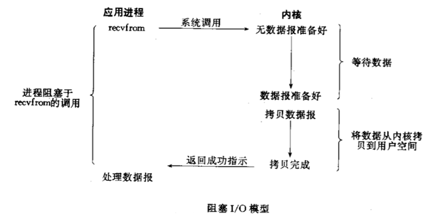
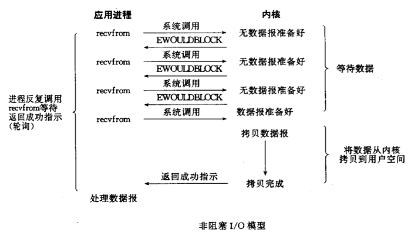
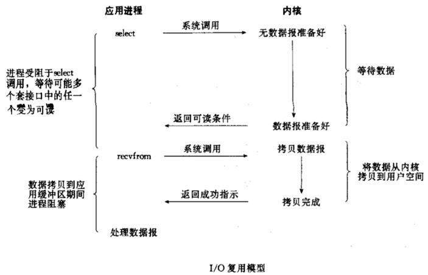
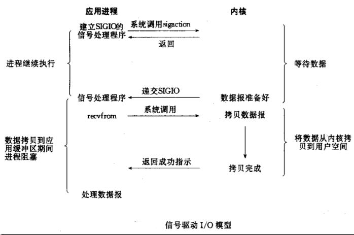
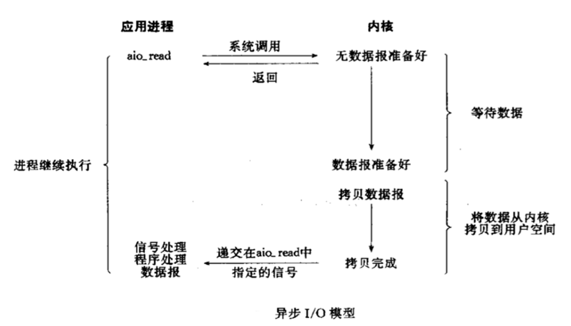

# IO

IO操作主要是指使用Java进行输入、输出操作。

Java中所有的IO机制都是基于**数据流**进行输入输出，这些数据流表示了字符或者字节数据的流动序列。

Java的IO流提供了读写数据的标准方法。任何Java中表示数据源的对象都会提供流的方式读写它数据的方法。

Java.io是大多数面向数据流的输入、输出类的主要软件。此外，Java对块传输也提供支持，Java.nio采用的便是块IO。

## 基本概念

### 数据流

一组有序，有起点、有终点的数据序列。包括输入流和输出流。

采用数据流的目的就是使得输入输出独立于设备。

输入流不关心数据源来自于何种设备（键盘、文件、网络），输出流不关心数据的目的是何种设备。

#### 输入流

程序从输入流读取数据源。数据源包括键盘、文件、网络等，即是将数据源读入到程序的通信通道。

#### 输出流

程序向输出流写入数据，将程序中的数据输出到外界（显示器、打印机、文件、网络等）的通信通道。

### IO流的分类

根据**处理数据类型**的不同分为：字符流和字节流。

- 字节流

  - 一次读入或者读出是8位二进制（一个字节）。

  - 字节流以字节为单位。
  - 字节流能处理所有类型的数据（图片，视频等都不在话下）
  - 字节流能处理字符数据

  > 字节是计算机中最小的数据单元。

  - 除文本数据之外的数据，优先考虑字节流

- 字符流

  - 一次读入或者读出是16位二进制（两个字节）。
  - 字符流以字符为单位，根据码表映射字符，一次可能读取多个字节
  - 字符流只能处理字符类型的数据
  - 字符流适合处理文本数据

根据**数据流向**的不同分为：输入流和输出流。

- 输入流

  输入流只能进行读操作。

- 输出流

  输出流只能进行写操作。

### 用户空间和内核空间

Linux将内存分为了用户空间和内核空间，只有内核空间可以直接调用硬件（磁盘、网卡等）。我们平时的用户进程一般是在用户空间，所以用户空间的进程要进行IO操作，需要与内核空间一起协作。

比如，读取数据操作需要进行以下两步：

1. 准备数据：把数据从硬件填充到内核空间的缓存里
2. 拷贝数据：把数据从内核空间复制到用户空间

### 同步和异步

同步和异步关注的是**消息通信机制**。更针对于被调用者。

- 同步：同步即是发起一个调用后，要等到调用完成（得到结果）后才返回。
- 异步：异步调用发起调用后立即得到被调用者的回应表示**已接收到请求**，但是**被调用者这时并没有返回结果**，此时我们可以处理其他请求，被调用者通常依靠事件、回调机制来通知调用者返回结果。

同步和异步最大的区别是**异步不需要等待被调用者的返回结果，并且异步会依靠事件、回调机制来通知调用者结果**。

Node.js使用的就是异步编程模型。

### 阻塞和非阻塞 

阻塞和非阻塞关注的是**程序在等待调用结果时的状态**。通俗来讲就是更针对于调用者。

- 阻塞：阻塞就是发起一个调用后，在被调用者返回结果之前，当前线程会**被挂起无法从事其他任务**，线程只有在得到结果后才会继续执行下去。
- 非阻塞：非阻塞是指发起一个调用后，该调用不会阻塞当前线程，当前线程不用一直等待结果返回，可以去执行其他任务。从表面上看非阻塞的方式能提高CPU的利用率，但是不要忘了这种方式会带来系统线程切换的增加。

### Linux中几种常见的IO模型

#### 同步阻塞

BIO模型图：

当左边的进程发起“系统调用”后，kernel先进入第一个阶段“等待数据”；数据报准备好后再进入第二个阶段“拷贝数据”。BIO在上述两个阶段都是**阻塞**的。

#### 同步非阻塞

同步非阻塞模型图：

上图可以看出应用进程`recvfrom`总是立即返回的。

#### IO多路复用

IO多路复用通过一种机制，可监视多个描述符，一旦某个描述符就绪（一般是读就绪或者写就绪），能够通知程序进行相应的读写操作。

IO多路复用技术就是为了解决线程阻塞到某个IO系统而出现的技术，使进程不阻塞于某个特定的IO系统调用。

IO复用模型：

select、poll函数介绍见[Linux I/O多路复用](https://www.linuxprobe.com/linux-io-multiplexing.html)。

epoll函数：

epoll函数是之前select和poll函数的增强版本，epoll函数较其他两个函数更加灵活，没有描述符限制。

epoll使用一个文件描述符管理多个描述符，将用户关系的文件描述符的时间存放到内核的一个事件表中，这样在用户空间和内核空间的复制操作只需进行一次。

epoll对文件描述符的操作有两种模式：

- LT（level trigger）：默认模式。当 epoll_wait 检测到描述符事件发生并将此事件通知应用程序，应用程序可以不立即处理该事件。下次调用 epoll_wait 时，会再次响应应用程序并通知此事件。
- ET（edge trigger）：当 epoll_wait 检测到描述符事件发生并将此事件通知应用程序，应用程序必须立即处理该事件。如果不处理，下次调用 epoll_wait 时，不会再次响应应用程序并通知此事件。

epoll的优点：

1. 在select/poll中，进程只有在调用一定的方法后，内核才对所有监视的文件描述符进行扫描，而epoll事先通过epoll_ctl()来注册一个文件描述符，已在基于某个文件描述符就绪时，内核会采用类似callback的回调机制迅速激活这个文件描述符，当进程调用epoll_wait()时遍得到通知。 // todo 我也没看懂。
2. 监视的描述符数量不受限制，它所支持的FD上限是最大可打开的文件数目，一般远大于select支持的1024。
3. IO的效率不会随着监视fd数量的增长而下降。select和poll实现需要自己不断轮询所有的fd集合，直到设备就绪，期间睡眠和唤醒可能会多次交替。而epoll只需要调用epoll_wait()不断轮询就绪链表，期间也可能会有多次睡眠和唤醒的交替。但是 select() 和 poll() 在“醒着”的时候要遍历整个fd集合，而 epoll 在“醒着”的时候只要判断一下就绪链表是否为空就行了，这节省了大量的 CPU 时间。这就是回调机制带来的性能提升。
4. select、poll每次调用都要把fd集合从用户态往内核态拷贝一次，而epoll只需要一次拷贝，节省了不少的开销。

#### 信号驱动

信号驱动模型：

#### 异步IO

异步IO模型：

## Java中的IO模型

### BIO

Blocking I/O，同步阻塞模式的IO，数据的读取和写入必须阻塞在一个线程内等待其完成，效率较低。

Tomcat使用多线程+BIO来实现web server。

数据库连接池使用线程池+BIO来实现。

### NIO

New I/O，同步，同时支持阻塞与非阻塞模式，主要使用非阻塞，从Java1.4中引入，对应`java.nio`包，提供了`Channel`、`Selector`、`Buffer`等接口或抽象方法。

### AIO

异步非阻塞IO模型。

# 参考

- [深入分析 Java I/O 的工作机制](https://www.ibm.com/developerworks/cn/java/j-lo-javaio/index.html)
- [Linux和Java的I/O模型](https://yasinshaw.com/articles/52)
- [怎样理解阻塞非阻塞与同步异步的区别？](https://www.zhihu.com/question/19732473)
- [[Linux I/O多路复用](https://www.linuxprobe.com/linux-io-multiplexing.html)]