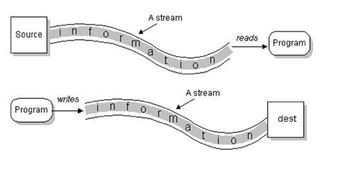

# IO

IO操作主要是指使用Java进行输入、输出操作。

Java中所有的IO机制都是基于**数据流**进行输入输出，这些数据流表示了字符或者字节数据的流动序列。

Java的IO流提供了读写数据的标准方法。任何Java中表示数据源的对象都会提供流的方式读写它数据的方法。

Java.io是大多数面向数据流的输入、输出类的主要软件。此外，Java对块传输也提供支持，Java.nio采用的便是块IO。

## 基本概念

### 数据流

一组有序，有起点、有终点的数据序列。包括输入流和输出流。

采用数据流的目的就是使得输入输出独立于设备。

输入流不关心数据源来自于何种设备（键盘、文件、网络），输出流不关心数据的目的是何种设备。

#### 输入流

程序从输入流读取数据源。数据源包括键盘、文件、网络等，即是将数据源读入到程序的通信通道。

#### 输出流

程序向输出流写入数据，将程序中的数据输出到外界（显示器、打印机、文件、网络等）的通信通道。

### IO流的分类

根据**处理数据类型**的不同分为：字符流和字节流。

- 字节流

  - 一次读入或者读出是8位二进制（一个字节）。

  - 字节流以字节为单位。
  - 字节流能处理所有类型的数据（图片，视频等都不在话下）
  - 字节流能处理字符数据

  > 字节是计算机中最小的数据单元。

  - 除文本数据之外的数据，优先考虑字节流

- 字符流

  - 一次读入或者读出是16位二进制（两个字节）。
  - 字符流以字符为单位，根据码表映射字符，一次可能读取多个字节
  - 字符流只能处理字符类型的数据
  - 字符流适合处理文本数据

根据**数据流向**的不同分为：输入流和输出流。

- 输入流

  输入流只能进行读操作。

- 输出流

  输出流只能进行写操作。

### 同步和异步

- 同步：同步即是发起一个调用后，要等到调用完成后才返回
- 异步：异步调用发起调用后立即得到被调用者的回应表示**已接收到请求**，但是被调用者这时并没有返回结果，此时我们可以处理其他请求，被调用者通常依靠事件、回调机制来通知调用者返回结果。

同步和异步最大的区别是异步不需要等待被调用者的返回结果。

### 阻塞和非阻塞 （todo）

- 阻塞：阻塞就是发起一个请求后，调用者一直等待请求结果返回，当前线程会被挂起无法从事**其他任务**，直到上一个任务完成后才能接着做其他的任务
- 非阻塞：非阻塞是指发一起一个请求后，调用者不用一直等待结果返回，可以去执行其他任务，当上一个请求完成后，CPU才接着完成后续操作。从表面上看非阻塞的方式能提高CPU的利用率，但是不要忘了这种方式会带来系统线程切换的增加。

## BIO

Blocking I/O，同步阻塞模式的IO，数据的读取和写入必须阻塞在一个线程内等待其完成，效率较低。

Tomcat使用多线程+BIO来实现web server。

BIO模型图：

当左边的进程发起“系统调用”后，kernel先进入第一个阶段“等待数据”， 是否阻塞指的就是这个阶段？？；数据报准备好后再进入第二个阶段“拷贝数据”，是否同步就是指的这个阶段？？。BIO在上述两个阶段都是**阻塞**的。

## NIO

New I/O，同步非阻塞模式的IO，从Java1.4中引入，对应`java.nio`包，提供了`Channel`、`Selector`、`Buffer`等接口或抽象方法。

# 参考

- [深入分析 Java I/O 的工作机制](https://www.ibm.com/developerworks/cn/java/j-lo-javaio/index.html)