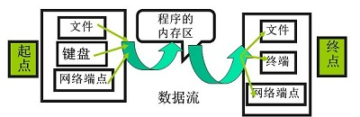

# IO

IO操作主要是指使用Java进行输入、输出操作。

Java中所有的IO机制都是基于**数据流**进行输入输出，这些数据流表示了字符或者字节数据的流动序列。

Java的IO流提供了读写数据的标准方法。任何Java中表示数据源的对象都会提供流的方式读写它数据的方法。

Java.io是大多数面向数据流的输入、输出类的主要软件。此外，Java对块传输也提供支持，Java.nio采用的便是块IO。

## 基本概念

### 数据流

一组有序，有起点、有终点的数据序列。包括输入流和输出流。

采用数据流的目的就是使得输入输出独立于设备。

输入流不关心数据源来自于何种设备（键盘、文件、网络），输出流不关心数据的目的是何种设备。

#### 输入流

程序从输入流读取数据源。数据源包括键盘、文件、网络等，即是将数据源读入到程序的通信通道。

#### 输出流

程序向输出流写入数据，将程序中的数据输出到外界（显示器、打印机、文件、网络等）的通信通道。

### IO流的分类

根据**处理数据类型**的不同分为：字符流和字节流。

- 字节流

  - 一次读入或者读出是8位二进制。

  - 字节流以字节为单位。
  - 字节流能处理所有类型的数据（图片，视频等都不在话下）
  - 字节流能处理字符数据

  > 字节是计算机中最小的数据单元。

  - 除文本数据之外的数据，优先考虑字节流

- 字符流

  - 一次读入或者读出是16位二进制。
  - 字符流以字符为单位，根据码表映射字符，一次可能读取多个字节
  - 字符流只能处理字符类型的数据
  - 字符流适合处理文本数据

根据**数据流向**的不同分为：输入流和输出流。

- 输入流

  输入流只能进行读操作。

- 输出流

  输出流只能进行写操作。