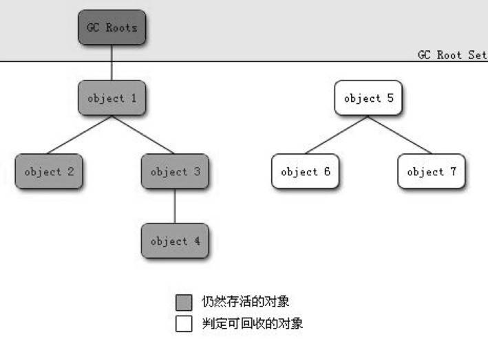
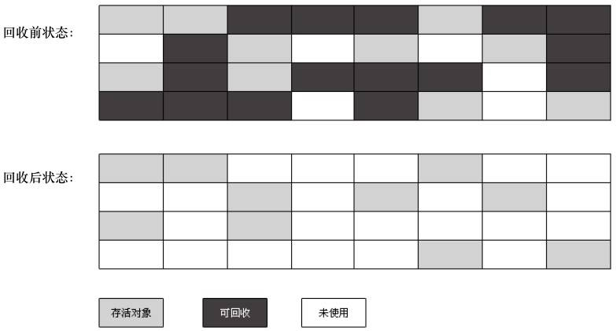
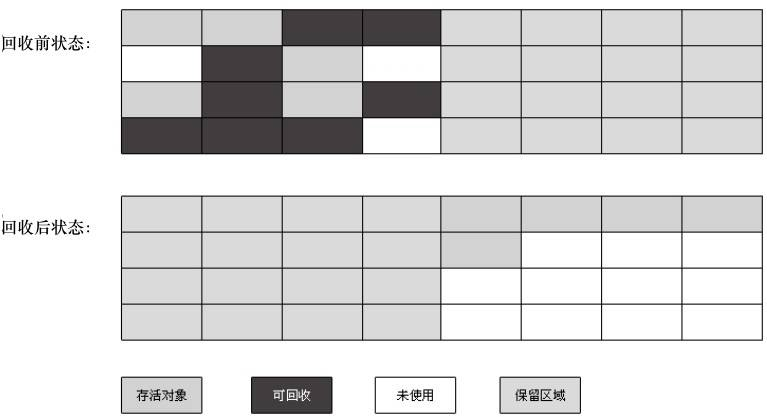
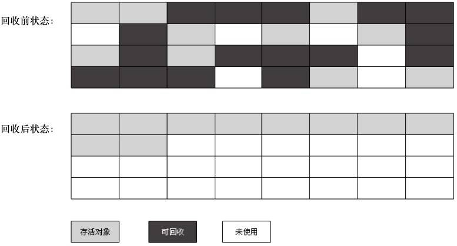
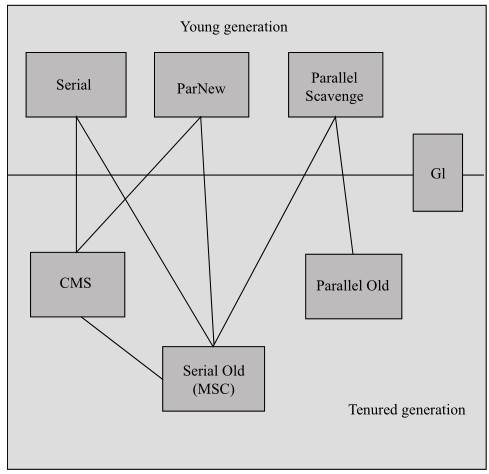
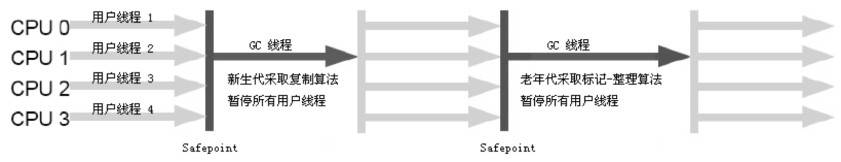
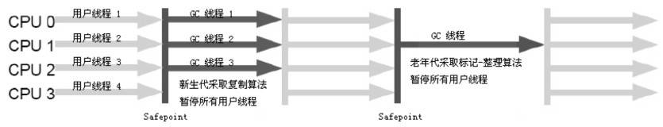
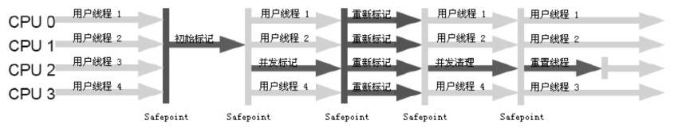

# JVM	

## Java内存运行时数据区域 

Java虚拟机在执行Java程序的过程中会把它所管理的内存划分为如下几个不同的数据区域。这些区域都有各自的用途及创建和销毁的时间，有的区域随着虚拟机进程的启动而存在（比如堆），有些区域则依赖用户线程的启动和结束来进行建立和销毁操作（比如Java虚拟机栈，本地方法栈）。


### 程序计数器（PC寄存器）

程序计数器是一块较小的内存空间，它可以看做是当前线程所执行的字节码的行号指示器。

字节码解释器工作时，通过改变程序计数器的值来选取下一条需要执行的字节码指令。分支、循环、跳转、异常处理、线程恢复等基础功能都需要依赖这个程序计数器。

程序计数器所在内存区域是**唯一一个**在Java虚拟机规范中没有规定任何`OOM`情况的区域。

#### 程序计数器线程私有的原因

 Java虚拟机的多线程是通过线程轮流切换并分配处理器执行时间的方式来实现的。在任一个确定时刻，一个处理器都只会执行一条线程中的命令。因此，为了保证各个线程切换后能恢复到正确的执行位置，每条线程都需要有一个独立的程序计数器。

#### 程序计数器的值

如果线程正在执行的是一个Java方法，计数器记录的是正在执行的虚拟机字节码指令的地址。

如果线程正在执行的是Native方法，计数器的值为空（Undefined）。

> Native方法是Java通过JNI直接调用本地C/C++库。
>
> 可以认为Native方法相当于C/C++暴露给Java的一个接口，Java通过调用接口进而调用到C/C++方法，由于该方法通过C/C++实现，无法产生相应的字节码。并且C/C++执行时的内存分配是由C/C++语言本身决定的，不由JVM决定。

### Java虚拟机栈（Java方法栈）

Java虚拟机栈（Java Virtual Machine Stacks）是**线程私有**的，它的生命周期与线程相同。

Java虚拟机栈描述的是Java方法执行的内存模型：每个方法在执行的同时都会创建一个栈帧（Stack Frame）用于存储局部变量表、操作数栈、动态链接、方法出口等信息。**每一个方法从调用到执行完成的过程，就对应着一个栈帧在虚拟机栈中入栈到出栈的过程**。

#### 局部变量表

局部变量表存放了**编译期**可知的各种**基本数据类型**（int、float、double、long，byte、short、boolean、char）、**对象引用**（reference类型，不等同于对象本身，可能是一个指向对象起始地址的指针，也可能是指向一个代表对象的句柄或其他与此对象相关的位置）和**returnAddress类型**（指向一条字节码指令的地址）。

64位的long和double类型的数据会占2个局部变量空间（Slot），其余数据类型只占用1个空间。

**局部变量表所需的内存空间在编译期间完成分配**，当进入一个方法时，这个方法需要在帧中分配多大的局部变量空间**完全是确定的**，在方法运行期间不会改变局部变量表的大小。

#### 操作数栈

操作数栈（Operand Stack）也常被称为操作栈，它是一个后入先出栈（LIFO）。

同局部变量表一样，操作数栈的最大深度也是在编译期确定（写入到方法Code属性的max_stacks数据项中）。

操作数栈的每一个元素可以是任意Java数据类型，32位的数据占用一个栈容量，64位的数据占用两个栈容量。

栈帧在刚刚创建时，操作数栈是空的。Java虚拟机提供的一些字节码指令会从局部变量表或者对象实例的字段中复制常量或变量值到操作数栈中，也提供了一些执行令用于从操作数栈取走数据、操作数据以及把操作结果重新入栈。

总之，如果一个变量想要被执行，就要加入到操作数栈中。

#### 动态链接

在一个class文件中，一个方法想要调用其他方法，需要将这些方法的符号引用转化为其在内存地址中的直接引用，而符号引用存在于方法区中的运行时常量池。

Java虚拟机栈中，每个栈帧都包含一个**指向运行时常量池中该栈所属方法**的符号引用，持有这个引用的目的是为了支持方法调用过程中的**动态链接（Dynamic Linking）**。

静态解析与动态链接：

- 上面所说的符号引用一部分会在**类加载阶段或者第一次使用时**就直接转化为直接引用，这类转化被称为**静态解析**；
- 另一部分将在每次**运行期间**转化为直接引用，这类状态被称为**动态链接**

#### 方法出口

指的是方法执行后下一步指令的地址。

方法正常完成时，则根据当前方法返回的字节码指令返回给调用者（具体是否有返回值及返回值的数据类型根据该方法返回的指令决定）；发生异常时，只要在本方法的异常表中没有搜索到相应的异常处理器，就会导致方法退出。

无论方法是怎样退出的，在方法退出后都需要返回到方法被调用的位置，程序才能继续执行下去，因此方法返回时可能需要在当前栈帧中保存一些信息来帮它恢复到上层方法的执行状态。

方法退出的过程实际上就等同于将当前栈帧出栈，因此退出方法可能的操作有：恢复上层方法的局部变量表和操作数栈，把返回值压入调用者的操作数栈中，调整程序计数器的值以指向方法调用后的下一条指令。

一般来讲，要是方法正常退出，调用者的程序计数器的值可作为返回地址，栈帧中可能会保存这个计数值；方法异常退出时，返回地址是通过异常处理器决定的，栈帧中一般不会保存这个值。

#### 异常情况

在Java虚拟机栈中规定了两种异常情况：

- `StackOverflowError`异常：如果线程请求的栈深度大于虚拟机所允许的深度，抛出此异常；
- `OutOfMemoryError`异常：如果虚拟机栈可以动态扩展（大部分Java虚拟机都支持动态扩展，也允许固定长度的虚拟机栈），如果扩展时无法申请到足够的内存，就会抛出OOM异常。

### 本地方法栈

本地方法栈的作用与Java虚拟机栈相似，唯一的区别是：Java虚拟机栈为虚拟机执行Java方法（字节码）服务，而本地方法栈则为虚拟机使用的`native`方法服务。

虚拟机规范中对本地方法栈中方法的使用语言、使用方式以及数据结构并没有强制的规定，所以不同的虚拟机可以自由的实现。有的虚拟机（比如Sun公司的Hotpot虚拟机）直接将本地方法栈和Java虚拟机栈合二为一。

#### 异常情况

与Java虚拟机栈一样，本地方法栈区域也会抛出`StackOverFlowError`和`OutOfMemoryError`。

### 堆	

Java堆（Java Heap）是被所有线程共享的一块内存区域，在虚拟机启动时创建。通常来说，Java堆是Java虚拟机所管理的内存中最大的一块。

Java堆的**唯一目的**就是存放对象实例，几乎所有的对象实例都在这里分配内存（未逃逸对象在栈上分配）。

#### 垃圾回收堆的划分

Java堆是垃圾回收管理的主要区域，所以有时候Java堆也被称为“GC堆”。

从内存回收的角度来看，由于现在收集器基本都采用分代收集的算法，所以Java堆可以细分为：新生代和老年代。再细致一点可以分为Eden空间、From Survivor空间、To Survivor空间等。

从内存分配的角度来看，线程共享的Java堆可以划分出多个线程私有的分配缓冲区（Thread Local Allocation Buffer）。

总的来说，不管Java堆怎么划分，堆中存储的内容都是对象实例。划分的目的是为了更好的进行内存回收。

#### 异常

如果在堆中没有完成实例分配，并且堆也无法扩展时，会抛出`OutOfMemoryError`异常。

### 方法区

方法区（Method Area）是各个线程共享的内存区域。它用于存储已被虚拟机加载的类信息、常量、静态变量以及即时编译器编译后的代码等数据。

方法区有一个别名是Non-Heap。

方法区也常常被称为”永久代“（Permanent Generation），其实方法区与永久代并不等价，只是因为HotSpot虚拟机选择吧GC分代收集扩展至方法区而已。事实上，GC行为在这个区域是比较少出现的，此区域的内存回收目标主要是针对常量池的回收和对类型的卸载。此外，此区域的回收效率并不高，比如对类型的卸载回收的条件非常苛刻。

#### 运行时常量池

运行时常量池（Runtime Constant Pool）是方法区的一部分。

Class文件中除了有类的版本、字段、方法、接口等描述信息之外，还有一项是常量池，用于存放编译期生成的各种字面量和符号引用，这部分内容将在**类加载后**进入方法区的运行时常量池存放。

运行时常量池与Class文件常量池相比还有另一个特征：运行时常量池具有动态性，Java语言并不要求常量一定要在编译器产生。除开预置入Class文件中常量池的内容之外，运行期间也能将新的常量放入常量池中（用的比较多的比如String类的intern()方法）。

#### 异常

根据Java虚拟机的规范，当方法区无法满足内存分配需求时，会抛出`OutOfMemoryError`异常。

## 直接内存

直接内存（Direct Memory）不属于虚拟机运行时数据区域，也不属于Java虚拟机规范中定义的内存区域。但这部分内存会被频繁使用，而且也可能导致OOM异常。

直接内存不会受到Java堆大小的闲置，会受到本机总内存（包括RAM及SWAP区等）的限制。

### 直接内存的应用

在JDK1.4中加入的`NIO`（New Input/Output）类，引入了一种基于通道（Channel）和缓冲区（Buffer）的I/O方式，它可以使用Native函数库直接分配**堆外内存**，然后通过一个存在Java堆中的`DirectByteBuffer`对象作为这块内存的引用进行操作。这类操作能避免Java堆和Native堆中来回复制数据，在有些场景能显著提高性能。

## 垃圾回收

垃圾回收（Garbage Collection）是Java虚拟机垃圾收集器提供的用于在空闲时间不定时回收无任何对象引用的对象所占据空间的一种机制。

### 判断对象是否已死

垃圾收集器在对堆进行垃圾回收之前，第一件事情就是要确定堆中的对象哪些还活着，哪些已死去。

#### 引用计数法

引用计数法（Reference Counting）是给每个对象添加一个引用计数器，每当有一个地方引用它时，计数器的值就加1，反正当引用失效时这个值就减一。所以，任何时刻计数器的值为0的对象就是不能被使用的对象。

引用计数法实现简单，判定效率也很高，但Java虚拟机并没有选用引用计数法来管理内存，其中最重要的原因是：**引用计数法很难解决对象之间的循环引用**。

```java
Object objA = new Object();
Object objB = new Object();
objA.instance = objB;
objB.instance = objA;
objA = null;
objB = null;
System.gc();
```

如果Java虚拟机使用引用计数法来管理内存，那么上面代码中的objA和objB就不会被回收，事实上运行上述代码这两个对象是会被回收的，侧面反映了Java虚拟机并不是使用引用计数法来判断对象是否存活的。

#### 可达性分析算法

可达性分析算法（Reachability Analysis）的基本思路是通过一系列被称为`GC Roots`的对象作为起点，从这些节点开始向下搜索，搜索所走过的路径被称为**引用链**（Reference Chain），当一个对象到GC Roots没有任何引用链相连时，则证明这个对象是不可用的。



从上图可以看出，右侧object5，6，7虽然相互有关联，但是它们的关联并不是以GC Roots为起点，所以在进行垃圾回收时它们会被判定为可回收的对象。

##### GC Roots

- 虚拟机栈中（栈帧中的本地变量表）引用的对象
- 本地方法栈中JNI（native方法）引用的对象
- 方法区中类静态属性引用的对象
- 方法区中常量引用的对象

栈的生命周期是跟着线程走的，栈中引用对象一般不收GC管理。方法区中引用的对象一般为不可变或者持久的，一般不依赖于某个对象实例。所以作为GC Root是的对象有稳定可靠的特性。

#### 引用

可达性分析算法和引用计数法判断对象是否存活都与引用有关。

在JDK1.2之后，Java堆引用的概念进行了扩充，将引用分为如下4种：

- 强引用（Strong Reference）。强引用是指在程序代码中普遍存在的，类似于`Object obj = new Objcet()`之类的引用。只要强引用还在，垃圾收集器永远不会回收被引用的对象。
- 软引用（Soft Reference）。软引用是用来描述一些还有用但非必需的对象。对于软引用关联着的对象 ，在系统将要发生内存溢出异常之前，将会把这些对象列入回收范围进行第二次回收。如果这次回收还没有足够的内存，才会抛出OOM异常。在JDK1.2之后，提供`SoftReference`类来实现软引用。
- 弱引用（Weak Reference）。弱引用也是用来描述非必需的对象，它的强度比软引用更弱一些，被弱引用关联的对象只能生存到下一次垃圾回收之前。当下一次垃圾收集发生之前，无论当前内存是否足够，都会回收掉只被弱引用关联的对象。在JDK1.2之后，`WeakReference`类用来实现软医用。
- 虚引用（Phantom Reference）。虚引用也被称为幽灵引用或幻影引用，它是所有引用中最弱的一种引用关系。一个对象是否有虚引用存在，完全不会对这个对象的生存时间造成影响，也无法通过虚引用来取得一个对象实例。为一个对象设置虚引用关联的**唯一目的**是：在这个对象被收集器回收时能收到一个系统通知。Java中通过`PhantomReference`来实现虚引用。

#### 判断对象是否已死

要真正宣告一个对象死亡，至少要经历两次标记过程：**第一次**是对象在经过可达性分析后发现没有与GC Roots相连接的引用链，该对象会被第一次标记并进行一次筛选，筛选的条件是此对象是否有必要执行finalize()方法。如果对象没有覆盖finalize()方法，或者finalize()方法已经被虚拟机调用过，虚拟机会将这些情况都视为没有必要执行finalize()方法。

如果这个对象被判定为有必要执行finalize()方法，这个对象会被放入一个叫F-Queue的队列之中，并在稍后由一个虚拟机自动建立的、低优先级的Finalizer线程去执行它（这里的执行是指虚拟机会触发这个方法，但并不承诺会等它运行完毕，这样做的原因是避免对象在finalize()执行缓慢或者死循环导致F-Queue队列中其他对象处于永久等待）。

finalize()方法是对象逃脱被回收命运的最后一次机会，随后GC将对F-Queue中的对象进行**第二次**小规模标记，如果对象要在finalize()方法中成功拯救自己，只需要重新与GC Roots引用链上的任何一个对象产生关联即可（比如把自己this赋值给一个变量或者对象的成员变量），产生关联后在第二次标记时该对象就会被移除“即将被回收”的集合。

所以，即使在可达性算法中被标记为不可达的对象，也并非死不可的。

#### 回收方法区

方法区的垃圾回收在Java虚拟机规范中不强制要求，但是确是实际存在的。比起在堆中的垃圾回收，方法区的效率明显要低得多。

方法区的垃圾回收主要回收**废弃常量**和**无用的类**两部分内容。

对于常量，假如没有任何对象引用常量池中的常量，也没有其他地方引用了这个字面量，如果此时发生垃圾回收，这个常量就有可能被系统清理出常量池。常量池中的其他类（接口）、方法、字段的符号引用也与此类似。

判断一个类是否是无用的类满足以下三个条件：

- 该类所有的实例都已经被回收，也就是Java堆中不存在该类的任何实例
- 加载该类的ClassLoader已经被回收
- 该类对应的java.lang.Class对象没有在任何地方被引用，无法在任何地方通过反射访问该类的方法

### 垃圾回收算法

#### 标记-清除算法

标记-清除算法（Mark-Sweep）算法是最基础的算法， 后续的收集算法都是基于标记清除算法的思路而改造所得。该算法分为标记和清除两个阶段：首先标记出所有需要回收的对象，在标记完成后统一回收所有被标记的对象。标记过程与判断对象是否已死部分相同。

标记清除算法的不足主要有两个：一是标记和清除两个过程的效率都不是很高；二是标记清除后会产生大量不连续的内存碎片，内存空间中碎片太多可能会导致程序在后续运行过程中找不到连续空间分配大对象，此时会触发另一次垃圾回收操作。

标记清除算法执行过程如下：



#### 复制算法

复制算法（Copying）是为了解决标记清除算法的效率问题而出现的算法。它将可用内存按容量划分为大小相等的两块，每次只使用其中的一块。当第一块的内存用完了，就将还活着的对象复制到另一块内存上面，然后再把已使用的第一块内存空间一次性清理掉。这样使得每次都是对整个半区进行内存回收，内存分配时也不用考虑内存碎片过多等复杂情况，只需移动堆顶指针按顺序分配即可，实现简单，运行高效。

复制算法的缺点就是将内存缩小为原来的一半，内存使用率过低。

现在的商业虚拟机基本都采用复制算法来回收**新生代**。只是不是以1:1的比例来划分内存空间，二是将内存分为一块较大的Eden空间和两块较小的Survivor空间，每次使用Eden和其中一块Survivor空间。当进行垃圾回收时，将Eden和Survivor中**还活着**（注意不是所有）的对象复制到另一块Survivor空间上，最后清理掉刚才使用的Eden和Survivor空间。Hotspot虚拟机默认Eden和Survivor空间大小比例是8:1，意思是只会浪费10%的内存。注意这里要是垃圾回收时有多于10%的对象存活，Survivor空间不够用时，需要依赖其他内存（老年代）进行分配担保（Handle Promotion）。

分配担保指的是如果另一块Survivor空间没有足够的内存存放上一次新生代垃圾回收活下来的对象时，这些对象将直接通过分配担保机制进入**老年代**。

复制算法执行过程如下（使用50%内存空间）：



#### 标记-整理算法

复制收集算法在对象存活率较高时需要进行较多的复制操作，此时效率将会变低。此外，如果不想浪费50%的空间，就需要有额外的空间进行分配担保，以应对垃圾回收后内存中所有对象都存活的极端情况，所以老年代一般不能用复制算法。

针对老年代的特点，标记-整理（Mark-Compact）算法产生了。其中标记过程仍与标记清除算法一样，而整理过程是让所有存活的对象都向一端移动，然后直接清理掉端边界以外的内存。

标记整理算法执行过程如下：



#### 分代收集算法

分代收集算法（Generational Collection）根据对象存活周期的不同将内存划分为几块（一般是把Java堆分为新生代和老年代），然后根据各个块的特点采用最适合的垃圾回收算法。目前的商业虚拟机都采用分代收集算法进行垃圾回收。

在新生代中，每次回收都会有大批对象死去，只有少量存活，此时可以选择使用复制算法，只需付出少量对象的复制成本就可以完成垃圾收集。

在老年代中，因为对象存活率较高，再加上老年代没有额外的空间对其中的对象进行分配担保，此时就必须使用标记清除算法或者标记整理算法来进行垃圾回收。

### Hotspot算法实现

#### 枚举根节点

#### 安全点

#### 安全区域

### 垃圾收集器

如果垃圾收集算法时内存回收的方法论，那么垃圾收集器就是内存回收的具体实现。

Java虚拟机规范并没有对垃圾收集器如何实现做任何规定，所以不同厂商、不同版本的垃圾收集器可能会有很大的差别。

下图是基于JDK1.7 Update14后的Hotspot虚拟机包含的所有收集器：



注：如果两个收集器之前存在连线，表示他们可以搭配使用。

#### Serial收集器

Serial收集器是一个**单线程**收集器，Serial使用复制算法进行垃圾收集。它只会使用一个CPU或一个收集线程进行垃圾收集工作，更重要的是**Serial收集器在进行垃圾回收时必须暂停其他所有的工作线程（Stop The World），直到它收集结束**。

STW由虚拟机由虚拟机在后台自动发起和自动完成，在用户不可见的情况下把用户正在工作的线程全部停掉。这对用户及其不友好。

下图是Serial、Serial Old收集器的运行过程:



#### ParNew收集器

ParNew收集器其实就是Serial收集器的**多线程**版本。其余行为包括Serial可控制的参数、收集算法（复制算法）、STW、对象分配规则、回收策略等都与Serial收集器一样。

ParNew收集器是许多运行在Server模式下的虚拟机首选的新生代收集器。其中有一个与性能无关但很重要的原因是：新生代除了Serial收集器外，只有ParNew收集器能与CMS收集器配合工作（可参见关系图）。

parNew、Serial Old收集器运行图如下：



#### Parallel Scavenge收集器

PS收集器是一个新生代收集器，使用复制算法，也是多线程的收集器。

PS收集器的最大特点是它收集的目标是**达到一个可控制的吞吐量**（Throughput）。而其他比如CMS收集器的目标是尽可能地缩短垃圾收集时的停顿时间。

吞吐量指的是CPU用于运行用户代码的时间与CPU总消耗时间的比值，即吞吐量=运行用户代码时间/（运行用户代码+垃圾回收时间）。比如虚拟机运行100分钟，其中1分钟用来进行垃圾回收，那么吞吐量就是99%。

停顿时间短适合需要与用户交互的程序，而高吞吐量可以高效率地利用CPU时间，尽快完成程序的运算任务，主要适合在后台运算而不需要太多交互的任务。

PS收集器提供了两个参数用于精确控制吞吐量：

- -XX:MaxGCPauseMillis：控制最大垃圾收集停顿时间。这个值是一个大于0的毫秒数，收集器会尽可能地保证内存回收花费的时间不超过这个值。需要注意的是这个值也并不是越小越好，GC停顿时间变短是需要牺牲吞吐量和新生代空间来换取的。
- -XX:GCTimeRatio：直接设置吞吐量大小。这个应是一个大于0且小于100的整数，默认值是99，也就是说允许最大1%的垃圾收集时间。

PS有一个参数-XX:+UseAdaptiveSizePolicy也很重要。这个是一个开关参数，当这个参数打开后，就不需要手动指定新生代的大小（-Xmn）、Eden与Survivor的比例（-XX:SurvivorRatio）、晋升老年代对象年龄（-XX:PretenureSizeThreshold）等细节参数了，虚拟机会根据当前系统的运行情况收集性能监控信息，动态调整这些参数以提供最合适的停顿时间或者对打吞吐量，这种调节方式被称为**GC自适应的调节策略**（GC Ergonomics）。

自适应调节策略是PS收集器的一大重要特点。

#### CMS收集器

CMS（Concurrent Mark Sweep）收集器是一种以获取最短回收时间为目标的收集器。CMS的收集过程由标记-清除算法实现。

CMS的运行过程主要由以下四步实现：

- 初始标记（CMS initial mark）：会进行STW，初始标记仅仅是标记以下GC Roots能直接关联到的对象，速度很快。
- 并发标记（CMS concurrent mark）：并发标记阶段就是进行GC Roots Tracing的过程。
- 重新标记（CMS remark）：会进行STW，重新标记是为了修正鬓发标记阶段因用户程序继续运作而导致标记产生变动的那一部分对象的标记记录，这个阶段的停顿时间会比初始标记长，但远比并发标记时间短。
- 并发清除（CMS concurrent sweep）：

注意，**初始标记和重新标记两个步骤仍然需要STW**。但由于整个过程中最占用耗时的并发标记和并发清除过程垃圾回收线程都可以和用户线程一起工作，所以从总体上看，CMS收集器的内存回收过程是与用户线程一起并发执行的。

CMS虽然有**并发收集**和**低停顿**的特点，但是也有3个比较明显的缺点：

- CMS收集器对CPU资源非常敏感。

  面对并发设计的程序都对CPU资源敏感。在并发阶段，收集线程虽然不会导致用户线程停顿，但是会因为占用了一部分线程（CPU资源）而导致应用程序变慢，总吞吐量会降低。

  CMS默认启动的回收线程数是（CPU数量+3）/4，意即当CPU在4个以上时，并发回收时垃圾收集线程会占用不少于25%的CPU资源，并且随着CPU数量的增加而下降。当CPU数量不足4个时，垃圾回收就对程序的影响就会变得很大，本来 CPU负载就很大了，垃圾回收时还要分出很大一部分的运算能力去执行收集线程，就可能导致用户程序的执行速度变慢。为了应对这些情况，虚拟机提供了一种名为“增量式并发收集器”（Incremental Concurrent Mark Sweep，或者i-CMS）的CMS收集器变化版，在i-CMS收集器中，在并发标记和并发清理时会让GC线程、用户线程交替运行，尽量减少GC线程独占CPU资源的时间，这样虽然垃圾回收时间会变得更长，但是对用户程序的影响就不那么大了。但是目前i-CMS已被声明为`deprecated`，不被推荐使用。

- CMS收集器无法处理浮动垃圾（Float Garbage）。

  在处理浮动垃圾时有可能出现“Concurrent Model Failure”，进而导致另一次Full GC的产生。

  由于CMS的并发清理阶段用户线程也在并行运行，清理的同时也会伴随新垃圾的不断产生，这部分垃圾出现在垃圾初始标记之后，CMS无法在本次垃圾回收过程中清理掉他们，只有等到下一次GC时再清理。这部分本次无法清理的垃圾就被称为**浮动垃圾**。

  在CMS垃圾收集阶段用户线程仍要运行，也就是还需要预留有足够空间的内存留给用户线程使用，因此CMS收集器不能像其他收集器一样等到老年代几乎完全被填满了再进行垃圾收集，需要预留一部分空间提供给并发收集时程序运作使用。在JDK1.5的默认设置中，CMS收集器在当老年代使用了68%的空间后就会被激活，如果老年代增长不是太快，可以通过调高`-XX:CMSInitiatingOccupancyFraction`参数来降低内存回收次数，获取更好的性能。在JDK1.6中这个值的默认值已提升至92%。

  要是CMS运行期间预留的内存无法满足程序需要，就会出现上述的“Concurrent Model Failure”失败，这时虚拟机会使用后备预案：临时启用Serial Old收集器来进行老年代的垃圾回收，使用这个应急方案会极大地加大停顿时间。所以`-XX:CMSInitiatingOccupancyFraction`参数过高会容易导致"Concurrent Model Failure”，此时性能反而会降低。

- CMS采用的标记-清除算法会产生大量空间碎片。

  大量空间碎片的存在会给大对象分配带来麻烦。即使老年代有大量空间的剩余，但是由于没有足够的连续空间，这样也会导致提前触发一次Full GC。

  为解决这个问题，CMS收集器提供了`-XX:UseCMSCompactAtFullCollection`开关参数（默认开启），用于在CMS收集器顶不住要进行Full FC时开启内存碎片的合并整理过程（单线程），整理会导致停顿时间变长。

  虚拟机还提供了另一个参数`-XX:CMSFullGCsBeforeCompact`（默认为0，表示每次都进行碎片整理），这个参数是用于设置执行多少次不压缩的Full GC后，跟着来一次带压缩的Full GC。

下图是CMS的运行过程:



#### Serial Old收集器

#### Parallel Old收集器

#### G1收集器

#### ZGC收集器

---

## Java代码是怎么运行的

### JRE与JDK

- JRE仅包含Java程序的必须组件，包括**Java虚拟机**以及**Java核心类库**等。
- JDK除了包含JRE之外，还附带了一系列开发、诊断工具。

### Java代码为什么要在虚拟机里运行

编译器将Java程序转换成Java虚拟机能识别的**指令序列**，这个指令序列也称为**Java字节码**。

好处之一是它的**可移植性**。一个Java程序一旦被转换成Java字节码，那么就可以在不同平台的虚拟机里运行。这就是常说的“一次编译，到处运行”。

虚拟机的一个好处就是它带来一个**托管环境（Managed Runtime）**。这个托管环境能代替我们处理一些代码中冗长切容易出错的部分。比如：**自动内存管理**与**垃圾回收**。此外，托管环境还提供了比如数组越界、动态类型、安全权限等动态检测，使我们免于书写很多与逻辑无关的代码。

### Java虚拟机如何运行Java字节码


以HotSpot虚拟机为例。

先将Java代码编译成class文件。再将.class文件加载到Java虚拟机中。

加载后的Java类会被存放于**方法区（Method Area）**中。所以，实际运行时会先执行方法区中的代码。

Java虚拟机在内存中划分出**堆**和**栈**来存储**运行时数据**。Java虚拟机将栈划分**Java方法栈（面向Java方法）**和**本地方法栈（c++，native方法，面向本地方法）**。

PC寄存器用来存放各线程的执行位置。

在运行过程中，当程序调用进入一个Java方法，虚拟机都会在当前线程的Java方法栈中生成一个**栈帧**，用来存放**局部变量**以及**字节码的操作数**。Java虚拟机不需要栈帧在内存里连续分布。

线程退出执行的当前方法时，不管是否正常返回，Java虚拟机都会弹出当前线程的栈帧并舍弃。

### 解释执行和即时编译（JIT，just-in-time）

Java字节码不能被计算机直接执行，Java虚拟机需要将字节码翻译成计算机可以识别的**机器码**。

解释执行：逐条将字节码翻译成机器码。解释执行的优势是无需等待编译。

即时编译：将一个方法中包含的所有字节码编译成机器码后再执行。即时编译的优势是经过编译后，实际运行速度会更快。

HotSpot采用混合模式：先执行字节码，然后将反复执行的热点代码以方法为单位进行即时编译。


### JVM的运行效率

即时编译是JVM提升启动性能和峰值性能的重要技术之一。

Hotspot内置多个即时编译器：C1、C2和Graal。引入多个编译器的原因是为了方便在编译时间和生成代码的执行效率之间做出取舍。

C1编译器，又叫Client编译器。编译时间较短，面向对启动性能有要求的客户端GUI程序，采用的优化手段相对简单。

C2编译器，又叫Server编译器。编译时间相对较长，但生成的代码执行效率较高。主要面向对峰值性能有高要求的服务端程序，采用的优化手段相对复杂。

从Java7开始，Hotspot默认采用分层编译的方式编译字节码：热点方法先被C1编译，然后热点方法中的热点进一步被C2编译。

Hotspot的即时编译放在额外的编译线程中进行。一般是1:2的配比配置C1和C2。

在计算资源充足的情况下，字节码的解释执行和即时编译和同时进行。编译完成后机器码会在下次调用该方法时启用，替换原本的解释执行。


## Java 虚拟机加载Java类

从class文件内存中的类，按先后顺序需要经过**加载、链接和初始化**三大步骤。

Java语言类型：

- 基本类型：Java虚拟机预先定义好。
- 引用类型
  - **类**：有对应的字节流。
  - **接口**：有对应的字节流。
  - **数组类**：由Java虚拟机直接生成。
  - 泛型参数：泛型参数在编译过程中会被擦除。


**字节流**最常见的形式是由Java编译器生成的class文件。此外，我们也可以在程序内部直接生成，或者从网络中获取字节流。不同形式的字节流，会被加载到Java虚拟机中，成为类或者接口。

无论是直接生成的数组类，还是加载后的类，Java虚拟机都需要对这些类进行链接和初始化。

### 加载

加载，指的是查找字节流并且以此创建类的过程。数组类没有对应的字节流，由Java虚拟机直接生成；而其他的类和接口，Java虚拟机需要借助类加载器来完成查找字节流的过程。

启动类加载器，boot class loader，由c++实现，没有对应的Java对象，在Java中只能用null替代。启动类加载是其他类加载器的“祖师爷”。

除了启动类加载器之外，其他的类加载器都是`java.lang.ClassLoader`的子类，这些类加载器有对应的Java对象。这些类加载器先要由另一个类加载器加载至Java虚拟机中才能执行类加载。

在Java9之前，启动类加载器负责加载最基础最重要的类，比如放在JRE的lib目录下jar包中的类。除了启动类加载器之外，**扩展类加载器**（extension class loader）和**应用类加载器**（application class loader）也是很重要的类加载器，这两个加载器均有Java核心类库提供。

扩展类加载器的父类是启动类加载器。它负责加载相对次要但又通用的类。

应用类加载器的父类加载器则是扩展类加载器。它负责记载应用程序路径下的类。

> 应用程序路径，指的是虚拟机参数 -cp/-classpath、系统变量 java.class.path 或环境变量 CLASSPATH 所指定的路径。

Java9引入了模块系统，把扩展类加载器改为了**平台类加载器**（platform class loader）。Java SE中除了少数几个关键模块（比如Java.base），其他模块都是由平台类加载器加载。

除了Java核心类库提供的类加载器，我们可以加入自定义类加载器来实现特殊的加载方式。比如，可以对class文件加密，在用自定义的类加载器解密。

除了加载，类加载器还提供了命名空间的作用。

在Java虚拟机中，类的唯一性是由类加载器实例以及类的全名一同确定。即使是同一串字节流，由不同的类加载器加载，也会得到两个不同的类。在大型应用中我们常利用这一特性来运行同一个类的不同版本。

#### 双亲委派模型

每当一个类加载器接收到加载请求时，它会将请求转发给父类加载器。在它的父类加载器没有找到所请求的类时，该类才会尝试去加载请求类。

### 链接

链接，指的是将创建好的类合并至Java虚拟机中，使之能够执行的过程。

链接可分为**验证、准备以及解析**三个阶段。

- 验证阶段：目的在于确保被加载的类能够满足Java虚拟机的约束条件。通常而言Java编译器生成的类文件必然满足Java虚拟机的约束条件。

- 准备阶段：为被加载类的静态字段分配内存。

  > Java代码中对静态字段的初始化会在后面的初始化阶段中进行。
  >
  > 除了分配内存之外，部分Java虚拟机还会在此阶段构造其他跟类层次相关的数据结构，比如用来实现虚方法的动态绑定的方法表。

- 解析阶段：非必须， 将符号引用解析成实际引用。如果符号引用指向一个未被加载的类，或者未被加载类的字段和方法，那么解析将触发这个类的加载。（注意 未必会触发这个类的链接和初始化）

  > 在 class 文件被加载至 Java 虚拟机之前，这个类无法知道其他类及其方法、字段所对应的具体地址，甚至不知道自己方法、字段的地址。因此，每当需要引用这些成员时，Java 编译器会生成一个**符号引用**。在运行阶段，这个符号引用一般都能够无歧义地定位到具体目标上。
  >
  > 举例来说，对于一个方法调用，编译器会生成一个包含目标方法所在类的名字、目标方法的名字、接收参数类型以及返回值类型的符号引用，来指代所要调用的方法。

### 初始化

类加载的最后一步便是初始化。目的是为常量值的字段赋值，以及执行<clinit>方法的过程。Java虚拟机会通过加锁来确保类的<clinit>方法仅被执行一次。

只有当初始化完成后，类才正式成为可以执行的状态。

在Java中，要初始化一个静态字段，恶意在声明时直接赋值，也可以在静态代码块中对其赋值。

如果直接赋值的静态字段被final修饰，并且它的类型是基本类型或字符串时，那么该字段会被Java编译器标记成**常量值**（ConstantValue），常量值的初始化直接由Java虚拟机完成。

除常量值之外的其他直接赋值操作，及所有静态代码块中的代码，会被Java编译器置于同一方法中，并把它命名为<clinit>。

类的初始化何时被触发：

1. 当虚拟机启动时，初始化用户指定的主类；
2. 当遇到用以新建目标类实例的 new 指令时，初始化 new 指令的目标类；
3. 当遇到调用静态方法的指令时，初始化该静态方法所在的类；
4. 当遇到访问静态字段的指令时，初始化该静态字段所在的类；（单例延迟初始化）
5. 子类的初始化会触发父类的初始化；
6. 如果一个接口定义了 default 方法，那么直接实现或者间接实现该接口的类的初始化，会触发该接口的初始化；
7. 使用反射 API 对某个类进行反射调用时，初始化这个类；
8. 当初次调用 MethodHandle 实例时，初始化该 MethodHandle 指向的方法所在的类。

## JVM如何执行方法调用

### 重载与重写

- 重载：同一类中名字相同，参数类型不同的方法，方法之间的关系称之为重载。
- 重写：子类定义了与父类方法中非私有方法同名的方法，并且这两个方法参数类型相同，那么这两个方法之间的关系是重写。

### JVM的静态绑定和动态绑定

#### 虚拟机识别方法

虚拟机识别方法关键在于**类名、方法名和方法描述符（method decriptor）**。

> 方法描述符，由方法的参数类型及返回类型构成。
>
> 在同一个类中如果出现多个名字相同并且方法描述符也相同的方法，Java虚拟机会在类的验证阶段报错。
>
> > 注意，编译阶段也会报错。

## Java垃圾回收

垃圾回收：将已经分配出去但不再使用的内存回收回来，以便能再次分配。

### 引用计数法与可达性分析

#### 引用计数法

为每个对象添加一个引用计数器，用来统计指向该对象的引用个数。

> 一旦某个对象的引用计数器为0，表明该对象已经死亡，可以被垃圾回收。
>
> 引用计数法弊端：
>
> - 需要额外的空间来存储计数器
> - 更新繁琐
> - 无法处理循环引用的对象（循环引用的对象所占据的空间不可回收，易造成内存泄漏）

#### 可达性分析算法

将一系列GC Roots作为初始的存活对象的集合，然后从该集和触发，探索所有能被该合集所引用到的对象，并将其假如到该集合中，这个过程我们称之为**标记（mark）**。最终未被探索到的对象即是死亡的，可被垃圾回收。

GC Roots：由堆外指向堆内的引用。

GC Roots包括但不限于以下几种：

- Java方法栈帧中的局部变量
- 已加载类的静态变量
- JNI handles
- 已启动且未停止的Java线程

可达性分析可以解决引用计数法不能解决的循环引用的问题。假如a、b相互引用，只要从GC Roots出发无法到达a或b，那么可达性分析就不会将他们加入存活的对象集合中。

可达性分析弊端：

多线程环境下，其他线程可能会更新已经访问过的对象中的引用，从而将引用设置为null（误报），或者将引用设置为未被访问过的对象（漏报）。

误报相对不那么严重，Java虚拟机最多损失了部分垃圾回收的机会。

漏报的情况，GC可能会回收事实上仍然被引用的对象内存。如果原引用访问已被回收的对象，很有可能会导致Java虚拟机崩溃。

#### stop-the-world

在Java虚拟机中，传统的垃圾回收算法采用的是Stop-the-world方法：停止其他非垃圾回收线程的工作，知道完成垃圾回收。

Stop-the-world造成了垃圾回收的暂停时间（GC pause）。

#### 如何判断一个对象是否死亡


## 参考

- 深入理解Java虚拟机

  


