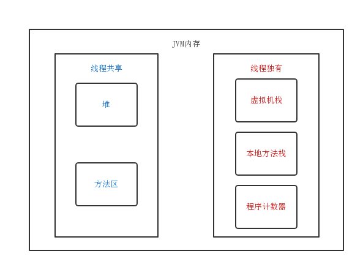

# Java内存模型

## 简述

Java虚拟机定义了一种内存模型（JMM）来屏蔽掉各种硬件系统和操作系统的访问差异，让Java程序在各种平台上都能达到一致的内存访问效果。

JMM是围绕在并发过程中如何处理原子性、可见性、有序性这三个特征而建立的，解决了三个问题就解决了缓存不一致问题。

> 原子性：Java中对基本类型的读取和赋值操作是原子性操作，这些操作不可中断，要么做完，要么不做。
>
> ```Java
> i = 1; // 赋值操作，只有一个步骤，原子操作
> j = i; // 两步操作，第一步读取i的值，第二步赋值，非原子操作
> i++; // i = i + 1, 读取i，+ 1，赋值三步操作，非原子操作
> ```
>
> JMM只实现了基本的原子性。如果要保证多个步骤操作的原子性，那就必须借助于`synchronized`或`Lock`来保证整块代码的原子性。

> 可见性：线程的工作内存和主内存之间存在着可见性的问题。
>
> Java利用`volatile`来保证可见性。当一个变量被`volatile`修饰时，线程对该变量的修改会立即刷新到主内存，当其他线程需要读取该变量时，会去主内存中读取刷新后的值（happens-before）。
>
> 除了`volatile`之外，`synchornized`关键字和`Lock`接口加锁也能保证代码块的原子性，但相对于`volatile`关键字而言开销更大。

> 有序性：JMM在基于as-if-serial语义的基础上，允许编译器和处理器对指令进行重排。
>
> >  as-if-serial语义：不管怎么重排序，程序的执行结果不能改变。
>
> JMM保证了指令重排不会影响到**单线程**的执行，但在多线程中容易出现问题。

> volatile只能保证可见性和有序性。

## Java内存模型
### 运行时数据区
)

- 线程共享区
    - 堆空间(Heap)：JVM规范中对顶，所有对象实例（new创建的对象）及数组都要再堆上进行分配。
    > 一般来说，堆空间都有一个默认大小（具体取决于JVM实现），可以根据需要动态扩展
    > 
    > 当创建对象需要再堆上分配空间，并且堆本身的空间不够无法申请额外的内存空间，会抛出**OutOfMemory**异常。

    - 方法区(Method Area)：存储已被JVM加载的类信息/常量和静态变量等数据。
    >  方法区与堆一样是线程共享区域。用于存储已被虚拟机加载的类信息/常量/静态变量/即时编译器编译后的代码等数据。
    > 
    > **静态域**和**常量池**（Runtime Constant Pool）就是方法区的一部分。
    
- 每个线程独有的内存空间
    - 程序计数器：每个线程都有一个程序计数器，用来表示线程当前需要执行的Java指令地址（这里指的是JVM内存空间地址）。
    > 虽然很多程序都是多线程的，但是通常都只有一个处理器，一个时刻只能执行一个线程。因为线程间切换十分迅速，所以给我们一种多线程的假象。
    > 
    > 假如一个线程1执行到某一指令被挂起，切换到线程2。线程2执行完需要切换到1，此时处理器必须知道线程1上次执行到哪个指令才能从中断处恢复。线程1存放上次执行到哪个指令的地址就叫程序计数器。
    
    - 栈（Stack）：
        - 虚拟机栈：JVM在执行一个线程的方法时，会为这个线程方法创建一个栈帧（可以理解为JVM栈空间中的一段存储区域）。这个栈帧用于存储局部变量表/操作数栈/动态链接和方法入口信息。
            - 局部变量表：存放了编译器可知的各种基本数据类型（byte short boolean char int float double long）的变量，对象引用类型（reference类型）。
            > 对象引用不等同于对象本身，根据不同虚拟机的实现，可能会是一个只想对象起始地址的引用指针，也可能会是指向一个代表对象的句柄或者其他与此对象相关的位置。
        
        - 本地方法栈：与虚拟机栈空间类似，与之不同的时本地方法栈用来存储本地方法调用的相关信息。
        > 与虚拟机栈区别：
        >   - 虚拟机栈为虚拟机执行Java方法（字节码）服务
        > - 本地方法栈为虚拟机使用到的本地方法服务

#### 堆中的内存不可见问题
> 虽然堆是线程共享的，但是在现代计算机中，为了高效率往往会在高速缓存区中缓存共享变量，CPU访问缓存比访问内存快很多。正是因为缓存的存在，所以在多线程访问共享变量的时候，就产生了内存可见性的问题。
> 
> 线程之间的共享变量存在主内存中，每个线程都有一个私有的本地内存，存储了该线程以读、写共享变量的副本。本地内存是Java内存模型的一个抽象概念，并不真实存在。它涵盖了缓存、写缓冲区、寄存器等。

### Java内存模型（JMM）
> Java线程之间的通信由Java内存模型控制。从抽象的角度来说，JMM定义了线程和主内存之间的抽象关系。

JMM抽象示意图：

由图可见：
- 共享变量都是存在主内存中
- 每个线程保存了主内存共享变量的副本
- 如果线程A与线程B之间要通信的话，必须经历下面2个步骤：
    - 线程A将本地内存A中更新过的共享变量刷新到主内存中去。
    - 线程B到主内存中去读取线程A之前已经更新过的共享变量。

所以，线程间通信，必须经过主内存。  

另外，根据JMM的规定，线程对共享变量的所有操作都必须在自己的本地内存中进行，不能直接从主内存中读取。

JMM通过控制主内存与每个线程的本地内存之间的交互，来提供内存可见性保证。
> - Java中的`volatile`关键字可以保证多线程操作共享变量的可见性以及禁止指令重排序
> - synchronized关键字不仅保证可见性，同时也保证了原子性（互斥性）。

在更底层，JMM通过内存屏障来实现内存的可见性以及禁止重排序。为了程序员的方便理解，提出了`happens-before`，它更加的简单易懂，从而避免了程序员为了理解内存可见性而去学习复杂的重排序规则以及这些规则的具体实现方法。这里涉及到的所有内容后面都会有专门的章节介绍。

### JMM与Java内存区域划分的区别与联系
- 区别：
    - JMM是抽象的，它用来描述一种规则，通过这个规则来控制各个变量的访问方式，围绕原子性，有序性，可见性等展开。
    - Java运行时内存的划分时具体的。
- 联系：
    - 都存在私有区域和共享区域。JMM中主内存属于共享区域，JMM的本地内存属于私有区域。

## 重排序与happens-before

### 重排序

JMM在基于as-if-serial语义的基础上，允许编译器和处理器对指令进行重排。

>  as-if-serial语义：不管怎么重排序，程序的执行结果不能改变。

重排序的优点： 提高性能。

## volatile