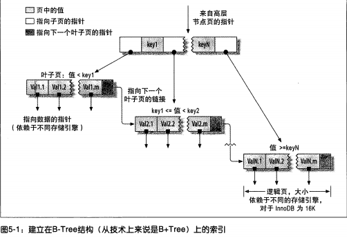

# MySQL

## SQL语句的执行过程

## 是什么影响了数据库性能

1. 超高的QPS和TPS

   - QPS：每秒钟处理的查询量

   - 风险：效率底下的SQL

2. 大量的并发和超高的CPU使用率

   - 大量的并发： 数据库连接数被占满（max_connections默认为100）

   - 超高的CPU使用率：因CPU资源耗尽而出现宕机

3. 磁盘IO

   - 磁盘IO性能突然下降（解决办法：使用更快的磁盘设备）
   - 其他大量消耗磁盘性能的计划任务（解决办法：调整计划任务）

4. 网卡流量

   - 网卡IO被占满

### 如何避免无法连接数据库的情况

1. 减少从服务器的数量
2. 进行分级缓存
3. 避免使用`select *`进行查询
4. 分离业务网络和服务网络

### 关于大表

什么样的表可以称之为大表：

- 记录行数巨大，大表超过千万行
- 表数据文件巨大，表数据文件超过10G

大表对查询的影响：

- 慢查询：很难再一定时间内过滤出所需要的数据

大表对DDL操作的影响

- 建立索引需要很长时间
  - MySQL版本< 5.5 建立索引会锁表，版本 >=5.5 不会锁表但是会引起主从延迟
- 修改表结构需要长时间锁表
  - 会造成长时间的主从延迟         
  - 影响正常的数据操作.

如何处理数据库中的大表

- 分库分表把一张大表分成多个小标
  - 分表主键的选择
  - 分表后跨分区数据的查询和统计

- 大表历史数据归档，减少对业务的影响
  - 归档时间的选择
  - 如何进行归档

## 事务

事务是数据库系统区别于其他一切文件系统的重要特性之一。

事务是一组具有原子性的SQL语句，或是一个独立的工作单元 (全部完成或者全部失败)。

### 事务的四大特性

1. 原子性(atomicity):一个事务必须被视为一个不可分割的最小工作单元，整个事务中的所有操作要么全部提交成功，要么全部失败，对于一个事务来说，不可能只执行其中的一部分操作

2. 一致性(consistency)：一致性是指事务将数据库从一种一致性状态转换到另一种一致性状态，在事物开始之前和事务结束后数据库中的数据的完整性没有被破坏

3. 隔离性(isolation)：隔离性要求一个事务对数据库中数据的修改，在未提交完成前对其他事务是不可见的

   >  SQL标准中定义的4种隔离级别：
   >
   > 1. 未提交读（READ UNCOMMITED）：隔离性低，并发性高
   > 2. 已提交读（READ COMMITED）：
   > 3. 可重复读（REPEATABLE READ）：innodb的默认隔离级别
   > 4. 可串行化（SERILIZABLE)：隔离性高，并发性低
   >
   > 上述四种隔离级别：隔离性由低到高，并发性由高到低

4. 持久性(durability)：一旦事务提交，则其所做的修改就会永久保存到数据库中。此时即使系统崩溃，已提交的修改数据也不会丢失。(磁盘不损坏的情况下)

### 并发事务带来的问题

1. 脏读（dirty read）：当一个事务正在访问数据并且对数据进行了修改，而这种修改还没有提交到数据库中，这时另外一个事务也访问了这个数据，然后使用了这个数据。因为这个数据是还没有提交的数据，那么另外一个事务读到的这个数据是“脏数据”，依据“脏数据”所做的操作可能是不正确的。

2. 丢失修改（Lost to modify）: 指在一个事务读取一个数据时，另外一个事务也访问了该数据，那么在第一个事务中修改了这个数据后，第二个事务也修改了这个数据。这样第一个事务内的修改结果就被丢失，因此称为丢失修改。	

   例如：事务1读取某表中的数据A=20，事务2也读取A=20，事务1修改A=A-2=18，然后事务2也修改A=A-1，最终结果A=19，事务1的修改被丢失。

3. 不可重复读（Unrepeatableread）：指在一个事务内多次读同一数据。在这个事务还没有结束时，另一个事务也访问该数据。那么，在第一个事务中的两次读数据之间，由于第二个事务的修改导致第一个事务两次读取的数据可能不太一样。这就发生了在一个事务内两次读到的数据是不一样的情况，因此称为不可重复读。
4. 幻读（Phantom read）：幻读与不可重复读类似。它发生在一个事务（T1）读取了几行数据，接着另一个并发事务（T2）插入了一些数据时。在随后的查询中，第一个事务（T1）就会发现多了一些原本不存在的记录，就好像发生了幻觉一样，所以称为幻读。

不可重复读和幻读的区别：

不可重复读的重点是修改比如多次读取一条记录发现其中某些列的值被修改，幻读的重点在于新增或者删除比如多次读取一条记录发现记录增多或减少了。

### 事务的隔离级别

### 大事务

运行时间比较长，操作的数据比较多的事务

- 锁定太多数据，造成大量阻塞和超时
- 回滚所需时间比较长
- 执行时间长，主从延迟

处理大事务

- 避免一次处理太多的数据
- 移除事务中不必要的select操作

## MySQL锁

在实际的数据库系统中，MySQL通过锁防止其他用户读取同一数据。

### 锁粒度

选择合适的锁粒度是一种提高共享资源并发性的方式。尽量锁定只需要修改的那部分数据，而不是所有资源。锁定的资源越少，并发性越好。

但是给资源加锁也需要耗费资源。锁的各种操作（获得锁，释放锁，检查锁是否解除。。）都会增加系统的开销。

锁策略就是在锁的开销和数据安全性之间取得平衡。在MySQL中，每种存储引擎都可以实现自己的锁策略和锁粒度。

表级锁和行级锁是MySQL最重要的两种锁策略。

#### 表级锁

表锁是MySQL中最基本，也是**开销最小的锁策略**。

表锁会锁定整张表。用户在对表进行操作（插入、删除、更新等）前，需要先获得锁，这会阻塞其他用户对该表的**所有读写操作**。

需要注意的是，只有在没有写锁时，其他读取的用户才能获取读锁，读锁之间是不会相互阻塞的。

此外，写锁有着比读锁更高的优先级。写锁的请求可能可能会被插入到读锁的前面，反之读锁是不能插入到写锁的前面的。

虽然储存引擎可以管理自己的锁，但是MySQL还是会使用各种有效的表锁来实现自己的目的。比如就算使用的innoDB存储引擎，但是MySQL还是会为诸如`ALTER TABLE`之类的语句使用表锁，而忽略存储引擎的锁机制。


## MySQL高性能优化

### schema与数据类型优化

#### 选择优化的数据类型

几个简单的优化原则

- 更小的通常更好：尽量使用**能正确存储数据的最小数据类型**。

  更小的数据类型占用更少的磁盘、内存和CPU缓存，处理的CPU周期更短，通常速度更快。

  需要注意，在数据量级大的表增加数据类型的范围非常耗时。

- 简单就好：简单数据类型的操作通常需要更少CPU周期。

  比如，整型比字符串操作代价更低，因为字符集和排序规则使字符串比整型更复杂。

  再比如，应该使用MySQL内建的时间类型（date、time、datetime）来存储时间类型，而不是使用字符串。

  再比如，应该使用整型来存储IP地址。

- 尽量避免NULL：虽然NULL通常是列值的默认属性，除非列需要存储NULL值，最好将列值声明为NOT NULL。

  存在NULL值的列使得索引、索引统计和值比较都变得相对复杂。

  实际上，将NULL值的列改为NOT NULL带来的性能提升通常比较小。所以这个优化可以不用优先考虑。

##### 整数

tinyint（8位存储空间），smallint(16)，mediumint（24），int（32），bigint（64），存储的值的范围是`$-2^(N-1)$` 到`$2^(N-1) - 1$`，N是存储空间位数。

整型的unsigned属性（无符号属性）表示不允许负值，可以将正数的存储上限提高一倍。比如tinyint unsigned的存储范围是0到`$2^(8) - 1$`。有符号和无符号的类型使用相同的存储空间，并具有相同的性能，可以根据所需的范围选择具体的类型。

MySQL为整数类型指定宽度对于大多数应用来讲是没有意义的，比如int(11)， 这个11不会限制值的合法范围，只是规定了某些交互工具显示字符的个数，对于存储和计算来讲，int(1)和int(20)是相同的。

##### 实数

实数是带有小数部分的数字。

float（4个字节存储）和double（8个字节）支持使用标准浮点运算进行**近似运算**。

decimal用于存储精确的小数。在MySQL5.0及以上版本，decimal支持**精确计算**。

浮点和decimal都可以指定小数精度，但decimal支持小数点前后所允许的最大位数（这会影响到列的空间消耗）。

浮点类型在存储同样范围的数值时，通场比decimal使用更少的空间。

由于decimal的计算需要额外的空间和计算开销，所以应尽量只对小数计算时使用decimal。此外还可以使用bigint替代decimal，用bigint存储相对较小单位的数据。

##### 字符串

varchar和char

varchar用于存储可变长的字符串，是最常见的字符串类型。varchar类型比定长类型更节省空间，它仅使用必要的空间。varchar需要额外1到2个字节记录字符串的长度（列长小于255，1个字节；大于则需要2个字节）。比如varchar(10) 需要11个字节的存储空间，varchar(1000)则需要1002字节存储空间。

varchar存储变长，节省了空间，但是变长的属性也使得在更新时需要花费更多的时间。

适用于varchar的场景：

- 字符串列的最大长度比平均长度大很多
- 列的更新少，产生相对较少的碎片
- 使用了utf-8等复杂的字符集，每个字符使用不同的字节存储数据（比如英文+汉字的组合）

char类型是定长的，数据库总是根据指定的字符串长度分配足够的空间。

适用于char的场景：

- 存储很短的字符串。存储短列cahr比varchar更有效率，比如char(1)只会占用1个字节的存储空间，vharchar(1)会占用2个字节。
- 存储的字符串的值都接近于同一个长度（比如md5加密后的密码）

bolb和text

存储很大的数据的数据类型。bolb使用二进制方式存储，没有排序规则和字符集，text采用字符方式存储，有排序规则和字符集。

MySQL把每个bolb和text的值当做一个独立的对象处理。

enum

##### 日期和时间

MySQL提供两种相似的时间类型：datetime和timestamp

#### 常见的设计问题

1. 太多的列
2. 太多的关联
3. 过度使用枚举
4. null值过度使用

#### 范式化和反范式化

##### 范式

1. 第一范式

   - 数据库表中的所有字段都只具有单一属性（每个属性不可再分）
   - 单一属性的列都是由基本的数据类型所构成的
   - 设计出来的表都是简单的二维表

2. 第二范式

   要求一个表中只具有一个业务主键，也就是说符合第二范式的表中不能存在非主键列只对部分主键的依赖关系（单一主键的表一定符合第二范式）

3. 第三范式

   指对每一个非主属性既不部分依赖于也不传递依赖于业务主键，就是在第二范式的基础上消除了非主属性对主键的传递依赖

范式的优缺点

- 优点

  - 可以尽量的减少数据冗余（数据更新快体积小）
  - 范式化的更新操作比反范式化更快
  - 范式化的表通常比反范式化更小

- 缺点

- - 对于查询需要对多个表进行关联
  - 更难进行索引优化

##### 反范式

反范式化是针对范式化而言的，反范式化就是为了性能和读取效率的考虑而适当的对数据库设计范式的要求进行违反，而语序存在少量的数据冗余（使用空间换取时间）

反范式化优缺点

- 优点
  - 可以减少表的关联
  - 可以更好的进行索引优化
- 缺点
  - 存在数据冗余，相对较难维护
  - 修改数据相对成本较大

- 

### 索引

索引是存储引擎用于快速找到记录的一种数据结构。

#### 索引类型

##### B-Tree索引

使用B-Tree数据结构来存储数据。除Archive之外的大部分MySQL引擎都支持B-Tree索引。

B-Tree意味着所有的值都是按顺序存储的，并且每一个叶子页代根的距离相同。



B-Tree之所以能加快访问数据的速度，因为存储引擎不再需要进行全表扫描来获取所需的数据，使用B-Tree可以从根节点开始搜索。// todo 找一个根节点的图

##### hash索引

哈希索引基于哈希表实现，只有精确匹配索引所有列的查询才有效。

存储引擎会对有哈希索引的列计算一个哈希码，哈希码是一个较小的值，并且不同键值的行计算出来的哈希码都不一样。哈希索引将所有的哈希码存储在索引中，在哈希表中保存指向每个数据行的指针。

MySQL中只有Memory引擎显示支持哈希索引。

##### 空间数据索引

myisam表支持空间索引，可以用作地理数据存储。

##### 全文索引

全文索引查找文本中的关键词，而不是直接比较索引中的值。

#### 索引优点

1. 索引大大减少了服务器需要扫描的数据量
2. 索引可以帮助服务器避免排序和临时表
3. 索引可以将随机IO变为顺序IO

#### 创建高性能索引

1. 选择独立的列

    索引列不能是表达式的一部分，也不能是函数的参数

   > eg. 
   >
   > ```mysq
   > select record_id from record where record_id + 1 > 5
   > ```

2. 前缀索引和索引选择性

   索引选择性

   是指不重复的索引值（也称基数，cardnality）和数据表的总数（#T）的比值，范围从1/#T到1之间。

   索引的选择性越高，查询效率越高。选择性越高的索引可以让MySQL在查找时过滤掉更多的行。

   唯一索引的选择性是1，是性能最好的索引。

3. 多列索引的创建

4. 选择合适的索引顺序

5. 聚簇索引

6. 覆盖索引

7. 使用索引扫描来做排序

8. 压缩索引

9. 冗余和重复索引

10. 索引和锁

#### 最左前缀索引原则

// todo  ： what + why+how +example

### explain

MySQL官方提供，分析MySQL是如何执行语句。

explain可以作用于select、delete、insert、replace和update语句。

**Table 8.1 EXPLAIN Output Columns**

| Column                                                       | JSON Name       | Meaning                                        |
| :----------------------------------------------------------- | --------------- | ---------------------------------------------- |
| [`id`](https://dev.mysql.com/doc/refman/8.0/en/explain-output.html#explain_id) | `select_id`     | The `SELECT` identifier                        |
| [`select_type`](https://dev.mysql.com/doc/refman/8.0/en/explain-output.html#explain_select_type) | None            | The `SELECT` type                              |
| [`table`](https://dev.mysql.com/doc/refman/8.0/en/explain-output.html#explain_table) | `table_name`    | The table for the output row                   |
| [`partitions`](https://dev.mysql.com/doc/refman/8.0/en/explain-output.html#explain_partitions) | `partitions`    | The matching partitions                        |
| [`type`](https://dev.mysql.com/doc/refman/8.0/en/explain-output.html#explain_type) | `access_type`   | The join type                                  |
| [`possible_keys`](https://dev.mysql.com/doc/refman/8.0/en/explain-output.html#explain_possible_keys) | `possible_keys` | The possible indexes to choose                 |
| [`key`](https://dev.mysql.com/doc/refman/8.0/en/explain-output.html#explain_key) | `key`           | The index actually chosen                      |
| [`key_len`](https://dev.mysql.com/doc/refman/8.0/en/explain-output.html#explain_key_len) | `key_length`    | The length of the chosen key                   |
| [`ref`](https://dev.mysql.com/doc/refman/8.0/en/explain-output.html#explain_ref) | `ref`           | The columns compared to the index              |
| [`rows`](https://dev.mysql.com/doc/refman/8.0/en/explain-output.html#explain_rows) | `rows`          | Estimate of rows to be examined                |
| [`filtered`](https://dev.mysql.com/doc/refman/8.0/en/explain-output.html#explain_filtered) | `filtered`      | Percentage of rows filtered by table condition |
| [`Extra`](https://dev.mysql.com/doc/refman/8.0/en/explain-output.html#explain_extra) | None            | Additional information                         |

- id：查询标志符

- select_type：查询类型，常见的有：

  | `select_type` Value                                          | JSON Name                    | Meaning                                                      |
  | ------------------------------------------------------------ | ---------------------------- | ------------------------------------------------------------ |
  | `SIMPLE`                                                     | None                         | Simple [`SELECT`](https://dev.mysql.com/doc/refman/8.0/en/select.html) (not using [`UNION`](https://dev.mysql.com/doc/refman/8.0/en/union.html) or subqueries) |
  | `PRIMARY`                                                    | None                         | Outermost [`SELECT`](https://dev.mysql.com/doc/refman/8.0/en/select.html) |
  | [`UNION`](https://dev.mysql.com/doc/refman/8.0/en/union.html) | None                         | Second or later [`SELECT`](https://dev.mysql.com/doc/refman/8.0/en/select.html) statement in a [`UNION`](https://dev.mysql.com/doc/refman/8.0/en/union.html) |
  | `DEPENDENT UNION`                                            | `dependent` (`true`)         | Second or later [`SELECT`](https://dev.mysql.com/doc/refman/8.0/en/select.html) statement in a [`UNION`](https://dev.mysql.com/doc/refman/8.0/en/union.html), dependent on outer query |
  | `UNION RESULT`                                               | `union_result`               | Result of a [`UNION`](https://dev.mysql.com/doc/refman/8.0/en/union.html). |
  | [`SUBQUERY`](https://dev.mysql.com/doc/refman/8.0/en/optimizer-hints.html#optimizer-hints-subquery) | None                         | First [`SELECT`](https://dev.mysql.com/doc/refman/8.0/en/select.html) in subquery |
  | `DEPENDENT SUBQUERY`                                         | `dependent` (`true`)         | First [`SELECT`](https://dev.mysql.com/doc/refman/8.0/en/select.html) in subquery, dependent on outer query |
  | `DERIVED`                                                    | None                         | Derived table                                                |
  | `DEPENDENT DERIVED`                                          | `dependent` (`true`)         | Derived table dependent on another table                     |
  | `MATERIALIZED`                                               | `materialized_from_subquery` | Materialized subquery                                        |
  | `UNCACHEABLE SUBQUERY`                                       | `cacheable` (`false`)        | A subquery for which the result cannot be cached and must be re-evaluated for each row of the outer query |
  | `UNCACHEABLE UNION`                                          | `cacheable` (`false`)        | The second or later select in a [`UNION`](https://dev.mysql.com/doc/refman/8.0/en/union.html) that belongs to an uncacheable subquery (see `UNCACHEABLE SUBQUERY`) |

- table：表示查询结果涉及的表

- **type**：查询连接类型，这个字段是判断查询是否高效的重要依据，常见类型有：

  - system：表内只有一条数据，是特殊的const
  - const：最多返回一条数据，针对主键或者唯一索引的查询。const只需查询一次，所以查询速度非常快。
  - eq-ref：常用于多表关联查询，表示被关联表和每一行都与关联表匹配，查询效率高，常用与Primary key和Unique key的关联查询。
  - ref：常用于多表查询（单表也行），用于**非主键或者唯一索引**的最左前缀匹配规则查询
  - range：表示**使用索引范围查询**，通过索引字段获取指定范围内的部分记录，range常用于 [`=`](https://dev.mysql.com/doc/refman/8.0/en/comparison-operators.html#operator_equal), [`<>`](https://dev.mysql.com/doc/refman/8.0/en/comparison-operators.html#operator_not-equal), [`>`](https://dev.mysql.com/doc/refman/8.0/en/comparison-operators.html#operator_greater-than), [`>=`](https://dev.mysql.com/doc/refman/8.0/en/comparison-operators.html#operator_greater-than-or-equal), [`<`](https://dev.mysql.com/doc/refman/8.0/en/comparison-operators.html#operator_less-than), [`<=`](https://dev.mysql.com/doc/refman/8.0/en/comparison-operators.html#operator_less-than-or-equal), [`IS NULL`](https://dev.mysql.com/doc/refman/8.0/en/comparison-operators.html#operator_is-null), [`<=>`](https://dev.mysql.com/doc/refman/8.0/en/comparison-operators.html#operator_equal-to), [`BETWEEN`](https://dev.mysql.com/doc/refman/8.0/en/comparison-operators.html#operator_between), [`LIKE`](https://dev.mysql.com/doc/refman/8.0/en/string-comparison-functions.html#operator_like), or [`IN()`](https://dev.mysql.com/doc/refman/8.0/en/comparison-operators.html#operator_in)操作符中。
  - index：表示**全表索引扫描**，与all类似（all是扫描全表，index扫描所有的索引树）。
    - 如果索引在所查询的列中，并且可用于满足表中所需的所有数据，则仅扫描索引树。在这种情况下，`Extra`列显示为 `Using index`。
    - 如果使用对索引的读取执行全表扫描，以按索引顺序查找数据行。 `Uses index`没有出现在 `Extra`列中。
  - all：全表扫描，效率低下，性能最差，没有用到索引（possible_keys与key都是null）

  type性能比较：

  > all < index < range < ref <eq_ref < const < system

- possible_keys：表示MySQL在查询时**可能使用到的索引**。

- key：MySQL查询时**真正使用到的索引**。

- ref：与索引相匹配的字段。

- rows：**预估**会被扫描的数据数量，越少越好。

- extra：额外信息展示

  - Using filesort：当 Extra 中有 `Using filesort` 时, 表示 MySQL 需额外的排序操作, 不能通过索引顺序达到排序效果. 一般有 `Using filesort`, 都建议优化去掉, 因为这样的查询 CPU 资源消耗大。
  - Using index：表示查询包括索引扫描（在索引中就能找到所查询的数据）。
  - Using temporary：查询使用了临时表，一般用于排序、分组和多表join。
  - Using where：使用了where条件查询。


## 参考

- 《高性能MySQL》
- [ mysql的最左前缀匹配原则]([https://glemontree.github.io/2017/12/10/[DB\]%20mysql%E7%9A%84%E6%9C%80%E5%B7%A6%E5%89%8D%E7%BC%80%E5%8C%B9%E9%85%8D%E5%8E%9F%E5%88%99/](https://glemontree.github.io/2017/12/10/[DB] mysql的最左前缀匹配原则/))
- [索引优化三大原则](https://my.oschina.net/u/923324/blog/1634787)