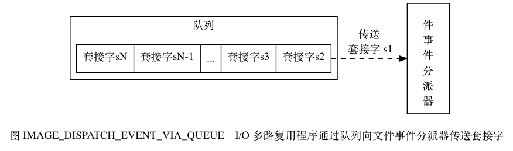

# Redis

> Redis 是一个开源（BSD许可）的，内存中的数据结构存储系统，它可以用作数据库、缓存和消息中间件。 它支持多种类型的数据结构，如 [字符串（string）](http://www.redis.cn/topics/data-types-intro.html#strings)， [散列（hash）](http://www.redis.cn/topics/data-types-intro.html#hashes)， [列表（list）](http://www.redis.cn/topics/data-types-intro.html#lists)， [集合（set）](http://www.redis.cn/topics/data-types-intro.html#sets)， [有序集合（sorted set）](http://www.redis.cn/topics/data-types-intro.html#sorted-sets) 与范围查询， [bitmaps](http://www.redis.cn/topics/data-types-intro.html#bitmaps)， [hyperloglogs](http://www.redis.cn/topics/data-types-intro.html#hyperloglogs) 和 [地理空间（geospatial）](http://www.redis.cn/commands/geoadd.html) 索引半径查询。 Redis 内置了 [复制（replication）](http://www.redis.cn/topics/replication.html)，[LUA脚本（Lua scripting）](http://www.redis.cn/commands/eval.html)， [LRU驱动事件（LRU eviction）](http://www.redis.cn/topics/lru-cache.html)，[事务（transactions）](http://www.redis.cn/topics/transactions.html) 和不同级别的 [磁盘持久化（persistence）](http://www.redis.cn/topics/persistence.html)， 并通过 [Redis哨兵（Sentinel）](http://www.redis.cn/topics/sentinel.html)和自动 [分区（Cluster）](http://www.redis.cn/topics/cluster-tutorial.html)提供高可用性（high availability）。

Redis由于数据存在内存中，读写操作非常快，因此被广泛应用于缓存方向。

## 缓存

缓存分为本地缓存和分布式缓存。

### 本地缓存

Java中，使用自带的`Map`或者`guava`实现的是本地缓存。

本地缓存最主要的特点是轻量及快速，生命周期随着jvm的销毁而结束。

本地缓存的缺点是不具有一致性，在多实例的情况下，每个实例都需要各自保存一份缓存。

### 分布式缓存

使用`redis`或者`memcached`实现的缓存可以称为分布式缓存。

分布式缓存具有一致性，多个实例共享一份缓存数据。

分布式缓存的缺点是需要保持redis或者memcached的高可用状态，整个程序架构比较复杂。

## Redis单线程模型

Redis基于**反应器模式**（Reactor）开发了自己的网络事件处理器，这个处理器被称为**文件事件处理器**（file event handler）。 

文件事件处理器使用**I/O多路复用**（multplexing）程序来监听多个套接字，并根据套接字目前执行的任务来为套接字关联不同的文件事件处理器。当被IO多路复用程序监听的套接字准备好执行连接应答（accept）、读取（read）、写入（write）、关闭（close）等操作时，与操作对应的文件事件随之产生，此时文件事件处理器就会调用之前关联好的事件处理器还处理这些事件。

文件事件处理器的四个组成部分：


如上图，IO多路复用程序可能监听多个套接字，因此产生的文件事件可能并发出现。

即使文件事件并发出现，IO多路复用程序还是会将所有事件产生的套接字都接入到一个队列里面，然后通过这个队列，以**有序，同步，每次一个套接字**的方式向文件事件分派器传输套接字。

IO多路复用程序传送套接字：




## Redis的数据结构

### String

String是Redis中最简单的数据类型，key-value键值对结构（与memcached一致）。

常用命令： set、get、decr、incr、mget（获取所有(一个或多个)给定 key 的值）。

常见应用场景： 常用计数（incr、decr），微博数，粉丝数等。

### Hash

hash 是一个 string 类型的 field 和 value 的映射表，hash 特别适合用于存储对象。进行修改操作可以修改指定key下某个指定filed的值。

常用命令： hget、hset、hgetall等

常见应用场景：存储对象信息，如商品信息，用户信息

### List

List是简单的字符串列表，按照插入顺序排序。你可以添加一个元素到列表的头部（左边）或者尾部（右边）

一个列表最多可以包含 `$2^32 -1$` 个元素 (4294967295, 每个列表超过40亿个元素)。

List的实现是一个双向链表，支持反向查找和遍历，方便操作但是带来了额外的内存开销。

常用命令：lpush、rpush、lpop、rpop、lrange（没有rrange）等

可以通过 lrange 命令，就是从某个元素开始读取多少个元素，可以基于 list 实现分页查询，这个很棒的一个功能，基于 redis 实现简单的高性能分页，可以做类似微博那种下拉不断分页的东西（一页一页的往下走），性能高。

常见应用场景：微博的关注列表、粉丝列表、消息列表。

### Set

Set是String类型的无序集合，集合成员具有唯一性。

Set底层是由hash表实现的，添加、删除、查找的复杂度都是`$O(1)$`。

Set的最大成员数是 `$2^32 -1$` 。

常用命令： sadd、spop、smembers、sunion等

Set提供了判断某个成员是否在一个Set集合内的接口（sismember），也提供了实现并集（sunion）、交集（sinter）、差集（sdiff）的操作。

应用场景：微博应用中，可用sinter（sinterstore）实现两个微博账号的共同关注。

### Sorted Set

Sorted Set是String类型的**有序集合**，集合成员也具有唯一性，但成员的score可以重复。

与Set不同的是，Sorted Set的每个元素都会关联一个double类型的score，Redis底层通过score来为集合内的成员进行排序。

同样，Sorted Set的底层也由hash表实现，添加、删除、查找的复杂度也为O(1)。

Sorted Set集合的最大成员数也为`$2^32 - 1$`。

常用命令：zadd、zrange、zrem、zcard等。Sorted Set也常备称为Zset。

应用场景：各种直播系统带权重的实时排行信息，比如刷礼物用户排行榜。

### **BitMap**

## Redis设置过期时间

存储在Redis中的值可以设置过期时间。

应用：项目中的token或者登陆信息，或者验证码有效期后自动过期等都很适合通过Redis设置过期时间来实现。

时间到期后，Redis通过**定期删除**+**惰性删除**的方式删除过期的key。

### 定期删除

Redis**默认每隔100ms**就**随机抽取部分**设置了过期时间的key，检查是否过期，如果过期就删除对应key。

随机抽取的原因是Redis如果存储了大量数据，每次都在100ms内遍历所有的key会给CPU带来很大负载。

### 惰性删除

假如过期的key没有被定期删除删除掉，还在停留在内存里，如果此时系统排查了过期的key，Redis才会删除掉排查的key。

显然定期删除+惰性删除都不能完全删除掉所有过期的key（比如定期删除后系统没有去排查），如果大量过期的key堆积在内存里导致内存即将耗尽，此时**Redis的内存淘汰机制**就可以解决这个问题。

## Redis的内存淘汰机制

设定了Redis的内存使用限制为具体值后，当内存快要达到使用上限时，Redis会根据指定的**内存淘汰机制**删除key。

Redis提供如下几种内存淘汰机制：

### volatile-lru

从已设置过期时间的数据集（server.db[i].expires）中挑选**最近最少使用**的数据淘汰。

### volatile-ttl

从已设置过期时间的数据集（server.db[i].expires）中挑选**将要过期**的数据淘汰。

### volatile-random

从已设置过期时间的数据集（server.db[i].expires）中**任意选择**数据淘汰。

### volatile-lfu

从已设置过期时间的数据集（server.db[i].expires）中挑选**最不常使用**的数据淘汰。Redis4.0版本新增。

### allkeys-lru

当内存不足以容纳新数据时，**在所有键空间中（server.db[i].dict），选择最近最少使用**的数据淘汰。这是最常用的内存淘汰策略。

### allkeys-random

从所有数据集（server.db[i].dict）中**任意选择数据**淘汰。

### allkeys-lfu

当内存不足以写入新数据时，在所有键空间（server.db[i].dict）中选择**最不常使用**的数据淘汰。Redis4.0新增。

### no-eviction

禁止淘汰数据。当内存不足以写入新数据时，此时再做写入数据操作会报错。

## Redis的持久化机制

Redis持久化是将内存中的数据写入到硬盘里面。

通常Redis持久化是为了重启机器、机器故障等之后能恢复数据。

Redis目前支持**快照（snapshoting，RDB）**和**只追加文件（append-only file，AOF）**两种方式持久化。

### 快照（RDB）

Redis通过创建快照来存储内存里的数据在某个时间点上的副本。

快照是Redis默认的持久化方式。

`redis.conf`中的配置格式如下：

```properties
save <seconds> <changes>
```

比如， `save 900 1`表示 900s后至少1个key发生变化，`save 300 10`表示300s后至少10个key发生变化，·save 60 10000`表示60s后至少1w个key发生变化，Redis都会触发BGSAVE命令创建快照。

Redis创建快照的几种方法：

- BGSAVE命令：客户端向Redis发送BGSAVE命令来创建一个快照。对于支持BGSAVE命令的所有平台（除Windows外的绝大多数平台），Redis调用fork来创建一个子进程，子进程负责将快照存入硬盘，父进程继续处理命令。
- SAVE命令：客户端向Redis发送SAVE命令来创建一个快照，接到SAVE命令的Redis在创建快照完毕之前不会再响应其他命令。SAVE命令通常作为在没有足够内存去执行BGSAVE命令情况下的备选项。
- save选项：redis.conf中设置的默认选项。详情如上。
- SHUTDOWN命令：Redis收到SHUTDOWN命令请求关闭服务器时，会执行SAVE命令阻塞所有客户端，并在SAVE命令执行完毕后关闭服务器。
- 不同Redis服务器之间的SYNC命令：如果主服务器目前没有执行BGSAVE操作，或主服务器并没有刚执行完BGSAVE操作，此时主服务器就会执行BGSAVE命令。

快照持久化适用于即使丢失一部分数据也不会造成一些大问题的应用。如果不能接受数据的丢失，可以考虑适用AOF持久化。

### 只追加文件（AOF）

## 常见问题

### 缓存雪崩

### 缓存击穿

### Redis并发争夺key

### Redis与数据库的双写一致性

## 参考

- [Redis总结](https://github.com/Snailclimb/JavaGuide/blob/master/docs/database/Redis/Redis.md)
- [Redis线程模型](<https://blog.csdn.net/Happy_wu/article/details/73732883>)