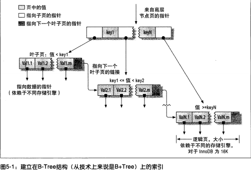

# MySQL

## SQL语句的执行过程

SQL在MySQL各个模块中的执行过程：


### Server层

Server 层包括连接器、查询缓存、分析器、优化器、执行器等，涵盖 MySQL 的大多数核心服务功能，以及所有的内置函数（如日期、时间、数学和加密函数等），所有跨存储引擎的功能都在这一层实现，比如存储过程、触发器、视图等。

#### 连接器

管理连接，权限验证。

校验用户名、密码，查询用户拥有的权限。之后，这个连接里面的权限判断逻辑，都将依赖于此时读到的权限。修改权限之后也需要等到下次重新连接后才能生效。

数据库里面，长连接是指连接成功后，如果客户端持续有请求，则一直使用同一个连接。短连接则是指每次执行完很少的几次查询就断开连接，下次查询再重新建立一个。

不管是长连接还是短连接，连接的建立过程都比较复杂，我们要尽量减少创建连接的动作，尽量使用长连接。但过度使用长连接会有弊端-因为长连接的累积，MySQL占用内存特别快。解决方案：

- 定期断开长连接
- MySQL 5.7 + 版本， 长连接之后执行`mysql_reset_connection`以初始化连接资源。（不会重新验证权限）

#### 查询缓存

查询缓存，命中直接返回结果。没有命中从分析器阶段继续执行。

查询缓存往往弊大于利：

> 查询缓存的失效非常频繁，只要有对一个表的更新，这个表上所有的查询缓存都会被清空。因此很可能你费劲地把结果存起来，还没使用呢，就被一个更新全清空了。
>
> 对于更新压力大的数据库来说，查询缓存的命中率会非常低。除非你的业务就是有一张静态表，很长时间才会更新一次。比如，一个系统配置表，那这张表上的查询才适合使用查询缓存。

MySQL8.0移除了查询缓存的功能。

#### 分析器

词法分析，语法分析。

先做词法分析，分析SQL语句的构成，分析SQL语句中的各个字符串代表什么，比如识别表名，列名等。

再做语法分析，分析根据MySQL的语法规则，判断输入的SQL是否符合语法。常见的MySQL错误`You have an error in your SQL syntax`就是语法分析给出的提示。一般语法分析提示第一个出现错误的位置。

#### 优化器

执行计划生成，索引选择。

在表里面有多个索引的时候，优化器会决定使用哪个索引。

在多表连接（join）查询的时候，优化器会决定各个表的连接顺序。不同的连接方案逻辑结果相同，但是执行效率不同，优化器决定是用哪个连接方案。

#### 执行器

操作引擎，返回结果。执行器负责执行优化器选择的方案。

执行器开始执行的时候，会先判断一下当前用户对SQL所操作的表有没有执行查询的权限，没有返回错误，有就打开表继续执行。

根据有无索引，执行器的执行流程不同：

- 无索引：

  1. 调用innodb接口取表的第一行，判断条件是否符合，不符合跳过，符合加至结果集中；

  2. 继续执行下一行，重复相同的判断，直到最后一行
  3. 将上述操作中的结果集返回给客户端

- 有索引：

  1. 调用innodb结果**获取满足条件的第一行**
  2. 循环取**满足条件的下一行**
  3. 返回结果集至客户端

### 存储引擎层

存储数据，提供读写接口。

存储引擎层负责数据的存储和提取。其架构模式是插件式的，支持 InnoDB、MyISAM、Memory 等多个存储引擎。现在最常用的存储引擎是 InnoDB，它从 MySQL 5.5.5 版本开始成为了默认存储引擎。

## 是什么影响了数据库性能

1. 超高的QPS和TPS

   - QPS：每秒钟处理的查询量

   - 风险：效率底下的SQL

2. 大量的并发和超高的CPU使用率

   - 大量的并发： 数据库连接数被占满（max_connections默认为100）

   - 超高的CPU使用率：因CPU资源耗尽而出现宕机

3. 磁盘IO

   - 磁盘IO性能突然下降（解决办法：使用更快的磁盘设备）
   - 其他大量消耗磁盘性能的计划任务（解决办法：调整计划任务）

4. 网卡流量

   - 网卡IO被占满

### 如何避免无法连接数据库的情况

1. 减少从服务器的数量
2. 进行分级缓存
3. 避免使用`select *`进行查询
4. 分离业务网络和服务网络

### 关于大表

什么样的表可以称之为大表：

- 记录行数巨大，大表超过千万行
- 表数据文件巨大，表数据文件超过10G

大表对查询的影响：

- 慢查询：很难再一定时间内过滤出所需要的数据

大表对DDL操作的影响

- 建立索引需要很长时间
  - MySQL版本< 5.5 建立索引会锁表，版本 >=5.5 不会锁表但是会引起主从延迟
- 修改表结构需要长时间锁表
  - 会造成长时间的主从延迟         
  - 影响正常的数据操作.

如何处理数据库中的大表

- 分库分表把一张大表分成多个小标
  - 分表主键的选择
  - 分表后跨分区数据的查询和统计

- 大表历史数据归档，减少对业务的影响
  - 归档时间的选择
  - 如何进行归档

## 事务

事务是数据库系统区别于其他一切文件系统的重要特性之一。

事务是一组具有原子性的SQL语句，或是一个独立的工作单元 (全部完成或者全部失败)。

### 事务的四大特性

1. 原子性(atomicity):一个事务必须被视为一个不可分割的最小工作单元，整个事务中的所有操作要么全部提交成功，要么全部失败，对于一个事务来说，不可能只执行其中的一部分操作

2. 一致性(consistency)：一致性是指事务将数据库从一种一致性状态转换到另一种一致性状态，在事物开始之前和事务结束后数据库中的数据的完整性没有被破坏
   
      > 在每次提交或回滚之后以及正在进行的事务处理期间，数据库始终保持一致状态，如果跨多个表更新了相关数据，则查询将看到所有旧值或所有新值，而不是新旧值的混合。
3. 隔离性(isolation)：隔离性要求一个事务对数据库中数据的修改，在未提交完成前对其他事务是不可见的

   >  SQL标准中定义的4种隔离级别：
   >
   > 1. 未提交读（READ UNCOMMITED）：隔离性低，并发性高
   > 2. 已提交读（READ COMMITED）：**事务提交后**的变更会被其他事务看到
   > 3. 可重复读（REPEATABLE READ）：innodb的默认隔离级别
   > 4. 可串行化（SERILIZABLE)：隔离性高，并发性低
   >
   > 上述四种隔离级别：隔离性由低到高，并发性由高到低

4. 持久性(durability)：一旦事务提交，则其所做的修改就会永久保存到数据库中。此时即使系统崩溃，已提交的修改数据也不会丢失。(磁盘不损坏的情况下)

### 并发事务带来的问题

1. 脏读（dirty read）：当一个事务正在访问数据并且对数据进行了修改，而这种修改还没有提交到数据库中，这时另外一个事务也访问了这个数据，然后使用了这个数据。因为这个数据是还没有提交的数据，那么另外一个事务读到的这个数据是“脏数据”，依据“脏数据”所做的操作可能是不正确的。

2. 丢失修改（Lost to modify）: 指在一个事务读取一个数据时，另外一个事务也访问了该数据，那么在第一个事务中修改了这个数据后，第二个事务也修改了这个数据。这样第一个事务内的修改结果就被丢失，因此称为丢失修改。	

   例如：事务1读取某表中的数据A=20，事务2也读取A=20，事务1修改A=A-2=18，然后事务2也修改A=A-1，最终结果A=19，事务1的修改被丢失。

3. 不可重复读（Unrepeatableread）：指在一个事务内多次读同一数据。在这个事务还没有结束时，另一个事务也访问该数据。那么，在第一个事务中的两次读数据之间，由于第二个事务的修改导致第一个事务两次读取的数据可能不太一样。这就发生了在一个事务内两次读到的数据是不一样的情况，因此称为不可重复读。

4. 幻读（Phantom read）：幻读与不可重复读类似。它发生在一个事务（T1）读取了几行数据，接着另一个并发事务（T2）插入了一些数据时。在随后的**当前读**查询中，第一个事务（T1）就会发现**多了一些原本不存在的记录**（修改不算），就好像发生了幻觉一样，所以称为幻读。

   > “幻读”说明：
   >
   > 当前读： select for update
   >
   > 在可重复读隔离级别下，普通的查询是快照读，是不会看到别的事务插入的数据的。因此，幻读在“当前读”下才会出现。

不可重复读和幻读的区别：

不可重复读的重点是修改比如多次读取一条记录发现其中某些列的值被修改，幻读的重点在于新增或者删除比如多次读取一条记录发现记录增多或减少了。

都是基于当前读查询

### 事务的隔离级别

#### 未提交读（READ UNCOMMITED)

未提交读是指一个事务还没提交时，它做的变更就能被别的事务看到。

未提交读隔离级别直接返回数据记录的最新值，没有生成视图。

未提交读隔离性低，并发性高。

#### 已提交读（READ COMMITED）

已提交读是指一个事务提交之后，它做的变更才会被其他事务看到。

#### 可重复读（REPEATABLE READ）

可重复读是指一个事务执行过程中看到的数据，总是跟这个事务在启动时看到的数据是一致的（快照读）。

在可重复读隔离级别下，事务启动时会创建一个视图，整个事务内都会使用这个视图（快照读），这个视图不会受其他事务更新所影响。

当然在可重复读隔离级别下，**未提交变更对其他事务也是不可见的**。

#### 可串行化（SERILIZABLE)

对同一行记录，读写都会加锁。当出现读写锁冲突的时候，后访问的事务必须等前一个事务执行完成，才能继续执行。

可串行化隔离性高，并发性低。

### 事务隔离的实现

在MySQL的**可重复读**隔离级别下，每条记录在更新时都会同时记录一条回滚操作。记录上更新后的最新值，都能通过回滚操作得到前一个状态的值。

### 大事务

运行时间比较长，操作的数据比较多的事务

- 锁定太多数据，造成大量阻塞和超时

- 回滚所需时间比较长

  > 大事务也意味着这个事务内存在很多老的事务试图，这些事务随时可以访问数据库里的任意数据，在这个大事务提交之前，数据库里它可能会用到的回滚数据都必须保留，会占用大量的存储空间。

- 执行时间长，主从延迟

处理大事务

- 避免一次处理太多的数据
- 移除事务中不必要的select操作

## MySQL锁

在实际的数据库系统中，MySQL通过锁防止其他用户读取同一数据。

### 锁粒度

选择合适的锁粒度是一种提高共享资源并发性的方式。尽量锁定只需要修改的那部分数据，而不是所有资源。锁定的资源越少，并发性越好。

但是给资源加锁也需要耗费资源。锁的各种操作（获得锁，释放锁，检查锁是否解除。。）都会增加系统的开销。

锁策略就是在锁的开销和数据安全性之间取得平衡。在MySQL中，每种存储引擎都可以实现自己的锁策略和锁粒度。

**表级锁**和**行级锁**是MySQL最重要的两种锁策略。

#### 表级锁

表锁是MySQL中最基本，也是**开销最小的锁策略**。

表级锁语法是`lock tables … read/write`。

表锁会锁定整张表。用户在对表进行操作（插入、删除、更新等）前，需要先获得锁，这会阻塞其他用户对该表的**所有读写操作**。

需要注意的是，只有在没有写锁时，其他读取的用户才能获取读锁，读锁之间是不会相互阻塞的。

此外，写锁有着比读锁更高的优先级。写锁的请求可能可能会被插入到读锁的前面，反之读锁是不能插入到写锁的前面的。

虽然储存引擎可以管理自己的锁，但是MySQL还是会使用各种有效的表锁来实现自己的目的。比如就算使用的innoDB存储引擎，但是MySQL还是会为诸如`ALTER TABLE`之类的语句使用表锁，而忽略存储引擎的锁机制。

#### 行级锁

MySQL 的行锁是在引擎层由各个引擎自己实现的。InnoDB 支持行锁，MyISAM不支持行锁。

##### 两阶段锁协议

在 InnoDB 事务中，行锁是在需要的时候才加上的，但并不是不需要了就立刻释放，而是要等到事务结束时才释放。这个就是**两阶段锁协议**。

两阶段锁协议定义，不论你怎样安排语句顺序，所有的操作需要的行锁都是在事务提交的时候才释放的。

##### 死锁和死锁检测

当并发系统中不同线程出现循环资源依赖，涉及的线程都在等待别的线程释放资源时，就会导致这几个线程都进入无限等待的状态，称为死锁。有点类似于Java中的锁。

出现死锁后的两个解决策略：

- 直接进入等待，直到超时：超时时间可以通过参数 `innodb_lock_wait_timeout` 来设置。innodb中该值的默认值是50s。
- 发起死锁检测：发现死锁后，主动回滚死锁链条中的某一个事务，让其他事务得以继续执行。将参数 `innodb_deadlock_detect` 设置为 on，表示开启这个逻辑，这个值在innodb中默认开启。**需要注意的是死锁检测会带来额外的性能开销，消耗很大的CPU资源。**

针对死锁检测带来的问题，可以考虑:

- 若果确保业务不会出现死锁，可以关闭死锁。。不推荐
- 控制并发。一般是通过数据库中间件实现。基本思路就是，对于相同行的更新，在进入引擎之前排队。这样在 InnoDB 内部就不会有大量的死锁检测工作了。

### InnoDB锁

#### [S锁与X锁](https://dev.mysql.com/doc/refman/5.7/en/innodb-locking.html#innodb-shared-exclusive-locks)

##### S锁(Shared Locks)

s锁允许持有该S锁的事务**读取**行数据。

如果一个事务T对行r持有S锁，允许其他事务对行r持有S锁，但不允许其他事务持对行r持有X锁。

##### X锁(Exclusive Locks)

X锁允许持有该X锁的事务**更新或者删除**一行数据。

如果一个事务T对行r持有X锁，那么不允许其他事务对行r持有S锁和X锁，除非T释放行r上的X锁。

#### [意向锁](https://dev.mysql.com/doc/refman/5.7/en/innodb-locking.html#innodb-intention-locks)

表级锁。表明某个事务随后对表里的某些行要加何种类型的锁（S锁/X锁）。

> MySQL中的表锁:
>
> LOCK TABLE my_tabl_name READ; 用读锁锁表，会阻塞其他事务修改表数据。
>
> LOCK TABLE my_table_name WRITE; 用写锁锁表，会阻塞其他事务读和写。

InnoDB允许某个表上共存表级锁和行级锁。

意向锁锁定规则：

- 如果一个事务想要在一个表内获取某行数据的S锁， 那么必须先在这个表上获取IS锁或更强的锁（表级S锁）；
- 如果一个事务想要在一个表内获取某行数据的X锁，那么必须先在这个表上获取IX锁。

##### 表级锁-类型兼容性

| 锁   | S      | X      | IS     | IX     |
| ---- | ------ | ------ | ------ | ------ |
| S    | 兼容   | 不兼容 | 兼容   | 不兼容 |
| X    | 不兼容 | 不兼容 | 不兼容 | 不兼容 |
| IS   | 兼容   | 不兼容 | 兼容   | 兼容   |
| IX   | 不兼容 | 不兼容 | 兼容   | 兼容   |

> 这里的S/X锁也指的是处于表级下的S/X锁。

##### 意向锁的作用

如果没有意向锁，MySQL判断锁冲突需要经过以下步骤：

1. 判断该表是否有其他事务用表锁锁表
2. 遍历判断表中的每一行是否被行锁锁住

其中第2步循环遍历的效率显然不高。

所以，意向锁的作用，在第2步判断的时候：

- 如果某个表没有加上意向锁，仍需遍历判断每一行是否加上行锁；
- 如果某个表已经存在意向锁，**无需遍历每一行数据， 只需判断意向锁是否兼容**就可以得出是否冲突的结果。

#### [记录锁(Record Locks)](https://dev.mysql.com/doc/refman/5.7/en/innodb-locking.html#innodb-record-locks)

记录锁，是对**索引**记录的锁定。

> A record lock is a lock on an index record. 
>
> For example, `SELECT c1 FROM t WHERE c1 = 10 FOR UPDATE;` prevents any other transaction from inserting, updating, or deleting rows where the value of `t.c1` is `10`.

记录锁始终锁定索引记录，即使没有定义索引的表也是如此。

> 没有指定索引的表，MySQL会创建一个隐藏的聚簇索引，记录锁就对这个索引进行加锁。

#### [间隙锁(Gap Locks)](https://dev.mysql.com/doc/refman/5.7/en/innodb-locking.html#innodb-gap-locks)

间隙锁，用于锁定索引记录之间的间隙， 或者锁定第一条记录之前（-∞，first]/最后一条记录之后（last, +∞]的区间。间隙可以跨越单个索引值，多个索引值，也可以为空。

> A gap lock is a lock on a gap between index records, or a lock on the gap before the first or after the last index record. 
>
> For example, `SELECT c1 FROM t WHERE c1 BETWEEN 10 and 20 FOR UPDATE;` prevents other transactions from inserting a value of `15` into column `t.c1`, whether or not there was already any such value in the column, because the gaps between all existing values in the range are locked.
>
> 间隙锁锁住一个间隙之后，不管该间隙间是否有值，该间隙内都不允许插入数据。

间隙锁是MySQL用于维持性能与并发平衡的一部分，只在大于RR事务隔离级别的情况下有效。

如果使用**唯一索引**（非联合唯一索引）来锁定行，间隙索引不会生效。

> `SELECT c1 FROM t WHERE id = 10 FOR UPDATE;`
>
> > 在这个示例里， (-∞，10)，（10， +∞）的间隙里都可以插入数据。
>
> `SELECT c1 FROM t WHERE id in (10, 20) FOR UPDATE;`
>
> > 同理，这里 (-∞，10)，(10, 20),（20， +∞）这些间隙里也可以插入数据。

如果使用的是联合唯一索引：

- 如果使用联合唯一索引的**部分列**锁定行， 间隙锁会生效

> 表c1存在联合唯一索引`UNIQUE KEY uk_c_d` (`c`,d)
>
> `SELECT c1 FROM t WHERE c = 10 FOR UPDATE;`，间隙锁有效

- 如果使用联合唯一索引的**所有列**锁定行

  - 能通过联合唯一索引锁定行： 间隙锁不生效

    > `SELECT c1 FROM t WHERE c = 10 and d = 10 FOR UPDATE;`, 数据库存在唯一记录， 间隙锁失效。
    >
    > 

  - 不能通过联合唯一索引锁定行： 间隙锁生效

    > `SELECT c1 FROM t WHERE c = 10 and d = 10 FOR UPDATE;`, 数据库不存在记录， 间隙锁有效。

间隙锁与间隙锁之间可以共存。一个事务产生得间隙锁不会妨碍另一个事务在相同间隙的锁定，共享间隙锁和排他间隙锁并没有区别。间隙锁得唯一目的就是阻止其他事务插入间隙。


#### [插入意向锁(Insert Intention Locks)](https://dev.mysql.com/doc/refman/5.7/en/innodb-locking.html#innodb-insert-intention-locks)

#### [AUTO-INC Locks](https://dev.mysql.com/doc/refman/5.7/en/innodb-locking.html#innodb-auto-inc-locks)

#### [Predicate Locks for Spatial Indexes](https://dev.mysql.com/doc/refman/5.7/en/innodb-locking.html#innodb-predicate-locks)

## MySQL高性能优化

### schema与数据类型优化

#### 选择优化的数据类型

几个简单的优化原则

- 更小的通常更好：尽量使用**能正确存储数据的最小数据类型**。

  更小的数据类型占用更少的磁盘、内存和CPU缓存，处理的CPU周期更短，通常速度更快。

  需要注意，在数据量级大的表增加数据类型的范围非常耗时。

- 简单就好：简单数据类型的操作通常需要更少CPU周期。

  比如，整型比字符串操作代价更低，因为字符集和排序规则使字符串比整型更复杂。

  再比如，应该使用MySQL内建的时间类型（date、time、datetime）来存储时间类型，而不是使用字符串。

  再比如，应该使用整型来存储IP地址。

- 尽量避免NULL：虽然NULL通常是列值的默认属性，除非列需要存储NULL值，最好将列值声明为NOT NULL。

  存在NULL值的列使得索引、索引统计和值比较都变得相对复杂。

  实际上，将NULL值的列改为NOT NULL带来的性能提升通常比较小。所以这个优化可以不用优先考虑。

##### 整数

tinyint（8位存储空间），smallint(16)，mediumint（24），int（32），bigint（64），存储的值的范围是`$-2^(N-1)$` 到`$2^(N-1) - 1$`，N是存储空间位数。

整型的unsigned属性（无符号属性）表示不允许负值，可以将正数的存储上限提高一倍。比如tinyint unsigned的存储范围是0到`$2^(8) - 1$`。有符号和无符号的类型使用相同的存储空间，并具有相同的性能，可以根据所需的范围选择具体的类型。

MySQL为整数类型指定宽度对于大多数应用来讲是没有意义的，比如int(11)， 这个11不会限制值的合法范围，只是规定了某些交互工具显示字符的个数，对于存储和计算来讲，int(1)和int(20)是相同的。

##### 实数

实数是带有小数部分的数字。

float（4个字节存储）和double（8个字节）支持使用标准浮点运算进行**近似运算**。

decimal用于存储精确的小数。在MySQL5.0及以上版本，decimal支持**精确计算**。

浮点和decimal都可以指定小数精度，但decimal支持小数点前后所允许的最大位数（这会影响到列的空间消耗）。

浮点类型在存储同样范围的数值时，通场比decimal使用更少的空间。

由于decimal的计算需要额外的空间和计算开销，所以应尽量只对小数计算时使用decimal。此外还可以使用bigint替代decimal，用bigint存储相对较小单位的数据。

##### 字符串

varchar和char

varchar用于存储可变长的字符串，是最常见的字符串类型。varchar类型比定长类型更节省空间，它仅使用必要的空间。varchar需要额外1到2个字节记录字符串的长度（列长小于255，1个字节；大于则需要2个字节）。比如varchar(10) 需要11个字节的存储空间，varchar(1000)则需要1002字节存储空间。

varchar存储变长，节省了空间，但是变长的属性也使得在更新时需要花费更多的时间。

适用于varchar的场景：

- 字符串列的最大长度比平均长度大很多
- 列的更新少，产生相对较少的碎片
- 使用了utf-8等复杂的字符集，每个字符使用不同的字节存储数据（比如英文+汉字的组合）

char类型是定长的，数据库总是根据指定的字符串长度分配足够的空间。

适用于char的场景：

- 存储很短的字符串。存储短列cahr比varchar更有效率，比如char(1)只会占用1个字节的存储空间，vharchar(1)会占用2个字节。
- 存储的字符串的值都接近于同一个长度（比如md5加密后的密码）

bolb和text

存储很大的数据的数据类型。bolb使用二进制方式存储，没有排序规则和字符集，text采用字符方式存储，有排序规则和字符集。

MySQL把每个bolb和text的值当做一个独立的对象处理。

enum

##### 日期和时间

MySQL提供两种相似的时间类型：datetime和timestamp

#### 常见的设计问题

1. 太多的列
2. 太多的关联
3. 过度使用枚举
4. null值过度使用

#### 范式化和反范式化

##### 范式

1. 第一范式
   要求有主键，并且要求每一个字段原子性不可再分

2. 第二范式

   在满足第一范式的基础上, 要求其他键对主键的依赖性: 表中的其他键必须完全依赖于主键
   > 比如有一个表order : order_id(pk), order_no, product_id, product_name 
   > 其中product_name 依赖于product_id 而不依赖于order_id , 不满足第二范式

3. 第三范式

   在满足第二范式的基础上, 非主键字段不能传递依赖于主键字段（不要产生传递依赖）
   > 比如 学生表student: student_id(pk), student_name, class_id, class_name
   > 其中 class_name依赖于class_id, class_id 依赖于student_id 产生了传递依赖 不符合第三范式

范式的优缺点

- 优点

  - 可以尽量的减少数据冗余（数据更新快体积小）
  - 范式化的更新操作比反范式化更快
  - 范式化的表通常比反范式化更小

- 缺点

  - 对于查询需要对多个表进行关联
  - 更难进行索引优化

##### 反范式

反范式化是针对范式化而言的，反范式化就是为了性能和读取效率的考虑而适当的对数据库设计范式的要求进行违反，而语序存在少量的数据冗余（使用空间换取时间）

反范式化优缺点

- 优点
  - 可以减少表的关联
  - 可以更好的进行索引优化
- 缺点
  - 存在数据冗余，相对较难维护
  - 修改数据相对成本较大


## 索引

索引是存储引擎用于快速找到记录的一种数据结构。

在MySQL中，存储引擎查找数据时，会先在索引中找到对应值，然后根据匹配的索引记录找到对应的数据行。

### 索引优点

1. 索引大大减少了服务器需要扫描的数据量
2. 索引可以帮助服务器避免排序和临时表
3. 索引可以将随机IO变为顺序IO

### 索引类型

#### B-Tree索引

在Innodb中，表都是根据主键顺序以索引的形式存放的，这种存储方式被称为**索引组织表**。InnoDB 使用了 B+ 树索引模型，所以数据都是存储在 B+ 树中的。

使用B-Tree数据结构来存储数据。除Archive之外的大部分MySQL引擎都支持B-Tree索引。

B-Tree意味着所有的值都是按顺序存储的，并且每一个叶子页代根的距离相同。



B-Tree之所以能加快访问数据的速度，因为存储引擎不再需要进行全表扫描来获取所需的数据，使用B-Tree可以从根节点开始搜索。// todo 找一个根节点的图

#### hash索引

哈希索引基于哈希表实现，只有**精确匹配索引**所有列的查询才有效。

存储引擎会对有哈希索引的列计算一个哈希码，哈希码是一个较小的值，并且不同键值的行计算出来的哈希码都不一样。哈希索引将所有的哈希码存储在索引中，在哈希表中保存指向每个数据行的指针。

MySQL中只有Memory引擎显示支持哈希索引。

##### hash索引缺点

- hash索引只有**精确匹配所有列**的查询才生效，如果在列(A, B)上建立联合索引，如果只查询A，则不会使用到索引。

- hash索引通过hash码存储，而不是按照索引值顺序存储，所以无法用于排序， 无法根据时间快速查找。

- hash索引只包含哈希值和行指针，不存储字段值，所以不能使用索引中的值来避免读取行。

  > 但hash索引大多是在内存完成，这一点的影响较小

- hash索引只支持等值比较查询（=，in），**不支持任何范围查找**（>，<）。

#### 空间数据索引

myisam表支持空间索引，可以用作地理数据存储。

#### 全文索引

全文索引查找文本中的关键词，而不是直接比较索引中的值。

### 创建高性能索引

#### 单列索引

索引列不能是表达式的一部分，也不能是函数的参数

> eg. 
>
> ```mysql
> select record_id from record where record_id + 1 > 5 // 不走索引
> ```

#### 前缀索引和索引选择性

##### 索引选择性

是指不重复的索引值（也称基数，cardnality）和数据表的总数（#T）的比值，范围从1/#T到1之间。

```mysql
select count(distinct user_id) / count(*) as selectivity from table_user;
```


索引的选择性越高，查询效率越高。选择性越高的索引可以让MySQL在查找时过滤掉更多的行。

唯一索引的选择性是1，是性能最好的索引。

#### 多列复合索引

MySQL支持多列复合索引的创建，一个索引最多可以包含16列。

在MySQL中，多列索引可用于索引中**所有列的查询，或者仅查询第一列，前两列，前三列**等等的查询。

```mysql
CREATE TABLE test (
    id         INT NOT NULL,
    last_name  CHAR(30) NOT NULL,
    first_name CHAR(30) NOT NULL,
    PRIMARY KEY (id),
    INDEX name (last_name,first_name)  // 索引顺序： last_name -> first_name
);

// 走索引的查询
SELECT * FROM test WHERE last_name='Jones';

SELECT * FROM test WHERE last_name='Jones' AND first_name='John';
  
SELECT * FROM test WHERE first_name='John' last_name='Jones'; // MySQL优化器会优化first_name与last_name的顺序

SELECT * FROM test WHERE last_name='Jones' AND (first_name='John' OR first_name='Jon');

SELECT * FROM test WHERE last_name='Jones' AND first_name >='M' AND first_name < 'N';

SELECT * FROM test WHERE last_name='Jones' OR last_name='John'; // last_name的or查询走索引，复合or查询不走索引，first_name的or查询不走索引
  
// 不走索引的查询
SELECT * FROM test WHERE first_name='John'; // first_name不满足最左前缀原则

SELECT * FROM test WHERE last_name='Jones' OR first_name='John'; // first_name和last_name的or查询


```


##### 最左前缀原则

如果MySQL表中存在着复合索引，那么MySQL优化器可以使用索引的**任何最左前缀（leftmost prefixes ）**来查找数据。

比如存在着一个索引`idx(col1, col2, col3)`，那么可以在`(col1)`，`(col1, col2)`及`（col1, col2, col3）`上使用索引。

```mysql
// 索引(col1, col2, col3)
// 满足最左前缀原则， 走索引
SELECT * FROM tbl_name WHERE col1=val1;
SELECT * FROM tbl_name WHERE col1=val1 AND col2=val2;

// 不满足最左前缀， 不走索引
SELECT * FROM tbl_name WHERE col2=val2;
SELECT * FROM tbl_name WHERE col2=val2 AND col3=val3;
```

#### 选择合适的索引顺序

确定索引顺序的第一原则是，如果通过调整顺序，可以少维护一个索引，那么这个顺序往往就是需要优先考虑采用的。

选择索引的顺序有一个经验法则：当不需要考虑排序和分组时，**将选择性高的的列放在索引的最前列**。

#### 聚簇索引 = 主键索引

#### 覆盖索引

如果一个索引**覆盖所有**要查询字段的值，那么这个索引就是覆盖索引。

覆盖索引可以减少树的搜索次数，显著提升查询性能，所以使用覆盖索引是一个常用的性能优化手段。

#### 索引下推

类似于like 'hello%’and age >10 检索，MySQL5.6版本之前，会对匹配的数据进行回表查询。

5.6版本后，会先过滤掉age<10的数据，再进行回表查询，减少回表率，提升检索速度

#### 使用索引扫描来做排序

#### 压缩索引

#### 冗余和重复索引

#### 索引和锁

### explain

MySQL官方提供，分析MySQL是如何执行语句。

explain可以作用于select、delete、insert、replace和update语句。

**Table 8.1 EXPLAIN Output Columns**

| Column                                                       | JSON Name       | Meaning                                        |
| :----------------------------------------------------------- | --------------- | ---------------------------------------------- |
| [`id`](https://dev.mysql.com/doc/refman/8.0/en/explain-output.html#explain_id) | `select_id`     | The `SELECT` identifier                        |
| [`select_type`](https://dev.mysql.com/doc/refman/8.0/en/explain-output.html#explain_select_type) | None            | The `SELECT` type                              |
| [`table`](https://dev.mysql.com/doc/refman/8.0/en/explain-output.html#explain_table) | `table_name`    | The table for the output row                   |
| [`partitions`](https://dev.mysql.com/doc/refman/8.0/en/explain-output.html#explain_partitions) | `partitions`    | The matching partitions                        |
| [`type`](https://dev.mysql.com/doc/refman/8.0/en/explain-output.html#explain_type) | `access_type`   | The join type                                  |
| [`possible_keys`](https://dev.mysql.com/doc/refman/8.0/en/explain-output.html#explain_possible_keys) | `possible_keys` | The possible indexes to choose                 |
| [`key`](https://dev.mysql.com/doc/refman/8.0/en/explain-output.html#explain_key) | `key`           | The index actually chosen                      |
| [`key_len`](https://dev.mysql.com/doc/refman/8.0/en/explain-output.html#explain_key_len) | `key_length`    | The length of the chosen key                   |
| [`ref`](https://dev.mysql.com/doc/refman/8.0/en/explain-output.html#explain_ref) | `ref`           | The columns compared to the index              |
| [`rows`](https://dev.mysql.com/doc/refman/8.0/en/explain-output.html#explain_rows) | `rows`          | Estimate of rows to be examined                |
| [`filtered`](https://dev.mysql.com/doc/refman/8.0/en/explain-output.html#explain_filtered) | `filtered`      | Percentage of rows filtered by table condition |
| [`Extra`](https://dev.mysql.com/doc/refman/8.0/en/explain-output.html#explain_extra) | None            | Additional information                         |

- id：查询标志符

- select_type：查询类型，常见的有：

  | `select_type` Value                                          | JSON Name                    | Meaning                                                      |
  | ------------------------------------------------------------ | ---------------------------- | ------------------------------------------------------------ |
  | `SIMPLE`                                                     | None                         | Simple [`SELECT`](https://dev.mysql.com/doc/refman/8.0/en/select.html) (not using [`UNION`](https://dev.mysql.com/doc/refman/8.0/en/union.html) or subqueries) |
  | `PRIMARY`                                                    | None                         | Outermost [`SELECT`](https://dev.mysql.com/doc/refman/8.0/en/select.html) |
  | [`UNION`](https://dev.mysql.com/doc/refman/8.0/en/union.html) | None                         | Second or later [`SELECT`](https://dev.mysql.com/doc/refman/8.0/en/select.html) statement in a [`UNION`](https://dev.mysql.com/doc/refman/8.0/en/union.html) |
  | `DEPENDENT UNION`                                            | `dependent` (`true`)         | Second or later [`SELECT`](https://dev.mysql.com/doc/refman/8.0/en/select.html) statement in a [`UNION`](https://dev.mysql.com/doc/refman/8.0/en/union.html), dependent on outer query |
  | `UNION RESULT`                                               | `union_result`               | Result of a [`UNION`](https://dev.mysql.com/doc/refman/8.0/en/union.html). |
  | [`SUBQUERY`](https://dev.mysql.com/doc/refman/8.0/en/optimizer-hints.html#optimizer-hints-subquery) | None                         | First [`SELECT`](https://dev.mysql.com/doc/refman/8.0/en/select.html) in subquery |
  | `DEPENDENT SUBQUERY`                                         | `dependent` (`true`)         | First [`SELECT`](https://dev.mysql.com/doc/refman/8.0/en/select.html) in subquery, dependent on outer query |
  | `DERIVED`                                                    | None                         | Derived table                                                |
  | `DEPENDENT DERIVED`                                          | `dependent` (`true`)         | Derived table dependent on another table                     |
  | `MATERIALIZED`                                               | `materialized_from_subquery` | Materialized subquery                                        |
  | `UNCACHEABLE SUBQUERY`                                       | `cacheable` (`false`)        | A subquery for which the result cannot be cached and must be re-evaluated for each row of the outer query |
  | `UNCACHEABLE UNION`                                          | `cacheable` (`false`)        | The second or later select in a [`UNION`](https://dev.mysql.com/doc/refman/8.0/en/union.html) that belongs to an uncacheable subquery (see `UNCACHEABLE SUBQUERY`) |

- table：表示查询结果涉及的表

- **type**：查询连接类型，这个字段是判断查询是否高效的重要依据，常见类型有：

  - system：表内只有一条数据，是特殊的const
  - const：最多返回一条数据，针对主键或者唯一索引的查询。const只需查询一次，所以查询速度非常快。
  - eq-ref：常用于多表关联查询，表示被关联表和每一行都与关联表匹配，查询效率高，常用与Primary key和Unique key的关联查询。
  - ref：常用于多表查询（单表也行），用于**非主键或者唯一索引**的最左前缀匹配规则查询
  - range：表示**使用索引范围查询**，通过索引字段获取指定范围内的部分记录，range常用于 [`=`](https://dev.mysql.com/doc/refman/8.0/en/comparison-operators.html#operator_equal), [`<>`](https://dev.mysql.com/doc/refman/8.0/en/comparison-operators.html#operator_not-equal), [`>`](https://dev.mysql.com/doc/refman/8.0/en/comparison-operators.html#operator_greater-than), [`>=`](https://dev.mysql.com/doc/refman/8.0/en/comparison-operators.html#operator_greater-than-or-equal), [`<`](https://dev.mysql.com/doc/refman/8.0/en/comparison-operators.html#operator_less-than), [`<=`](https://dev.mysql.com/doc/refman/8.0/en/comparison-operators.html#operator_less-than-or-equal), [`IS NULL`](https://dev.mysql.com/doc/refman/8.0/en/comparison-operators.html#operator_is-null), [`<=>`](https://dev.mysql.com/doc/refman/8.0/en/comparison-operators.html#operator_equal-to), [`BETWEEN`](https://dev.mysql.com/doc/refman/8.0/en/comparison-operators.html#operator_between), [`LIKE`](https://dev.mysql.com/doc/refman/8.0/en/string-comparison-functions.html#operator_like), or [`IN()`](https://dev.mysql.com/doc/refman/8.0/en/comparison-operators.html#operator_in)操作符中。
  - index：表示**全表索引扫描**，与all类似（all是扫描全表，index扫描所有的索引树）。
    - 如果索引在所查询的列中，并且可用于满足表中所需的所有数据，则仅扫描索引树。在这种情况下，`Extra`列显示为 `Using index`。
    - 如果使用对索引的读取执行全表扫描，以按索引顺序查找数据行。 `Uses index`没有出现在 `Extra`列中。
  - all：全表扫描，效率低下，性能最差，没有用到索引（possible_keys与key都是null）

  type性能比较：

  > all < index < range < ref <eq_ref < const < system

- possible_keys：表示MySQL在查询时**可能使用到的索引**。

- key：MySQL查询时**真正使用到的索引**。

- ref：与索引相匹配的字段。

- rows：**预估**会被扫描的数据数量，越少越好。

- extra：额外信息展示

  - Using filesort：当 Extra 中有 `Using filesort` 时, 表示 MySQL 需额外的排序操作, 不能通过索引顺序达到排序效果. 一般有 `Using filesort`, 都建议优化去掉, 因为这样的查询 CPU 资源消耗大。
  - Using index：表示查询包括索引扫描（在索引中就能找到所查询的数据）。
  - Using temporary：查询使用了临时表，一般用于排序、分组和多表join。
  - Using where：使用了where条件查询。

## MySQL实现排名

#### =与=：

- `=` 在set（包括update set）时是赋值的作用，其他都是比较运算符的作用。
- `:=` 在set及**select**等情况下都是赋值的作用。因此，在select中用变量实现行号的时候，必须使用`:=`。

### 普通排名

```mysql
-- 表
CREATE TABLE `user` (
  `id` int(11) NOT NULL AUTO_INCREMENT,
  `name` varchar(255) CHARACTER SET utf8 COLLATE utf8_general_ci NOT NULL,
  `age` int(11) NOT NULL,
  PRIMARY KEY (`id`)
) ENGINE=InnoDB AUTO_INCREMENT=0 DEFAULT CHARSET=utf8;

-- 数据
id  name 	age
1	alice	15
2	bobby	11
3	ciro	12
4	daisy	12
5	eden	13
```

在MySQL中，声明一个变量需要用`@`符号，我们可以先声明一个变量`@rank`，通过`@rank`变量实现行号：

```mysql
-- 在set中使用 := 或 = 并没有区别，都是赋值
SET @rank := 0;
SELECT *, @rank := @rank + 1 as ageRank FROM `user` ORDER BY age DESC;

-- 一起执行的结果
-- 注意，先执行set， 后续多次执行ageRank会顺序递增（@rank在select中更新）
id  name 	age ageRank
1	alice	15	1
5	eden	13	2
3	ciro	12	3
4	daisy	12	4
2	bobby	11	5
```

`@rank := @rank + 1` 此时的`:=`是赋值的作用，所以先执行`@rank + 1`，再进行赋值以达到实现行号的作用。

如果用`@rank = @rank + 1`， 中间是`=`，`=`在select中是比较运算符，此时`@rank`不等于`@rank + 1`，所以ageRank会始终返回0。

```mysql
SET @rank := 0; 
-- 在select中使用:=才是赋值
SELECT *, @rank = @rank + 1 as ageRank FROM `user` ORDER BY age DESC

-- 结果
id  name 	age ageRank
1	alice	15	0
5	eden	13	0
3	ciro	12	0
4	daisy	12	0
2	bobby	11	0
```

我们也可以用如下查询来替换避免`SET`赋值：

```mysql
-- 多次执行结果一样（ 在SELECT @rank := 0 中更新@rank为0）
SELECT
	usr.*,
	@rank := @rank + 1 ageRank
FROM
	`user` usr,
	( SELECT @rank := 0 ) r -- select中定义变量并通过:=赋值
ORDER BY
	usr.age desc;
```

### 并列递增排名

如果两个值相等的数据想要等得到同一排名，并且后续排名递增增长，我们新增一个变量`@preRank`来表示上一个排名的值：

```mysql
SET @curRank = 0;
SET @preRank = NULL; -- 注意初始化的值， 如果初始化为0且排序后第一条是age=0的数据，ageRank结果会从0开始

SELECT usr.*,
	@curRank := IF(@preRank = age, @curRank, @curRank + 1) as ageRank, -- 判断上一条数据的值是否与当前相等， 相等排名不变 ，不等排排名+1
	@preRank := age -- 初始化@preRank， 注意位置在if判断之后
FROM `user` usr ORDER BY usr.age DESC;

-- 结果 
id  name 	age ageRank @preRank := age
1	alice	15	1		15
5	eden	13	2		13
3	ciro	12	3		12
4	daisy	12	3		12
2	bobby	11	4		11

-- 通过case when控制
SET @curRank := 0;
SET @preRank := NULL; 
SELECT
	*,
    CASE 
        WHEN @preRank = age THEN @curRank  -- 注意此时用的是 = ，切位置不能调换
        WHEN @preRank := age THEN @curRank := @curRank + 1 -- 如果这一步在前面那永远都不会执行第后续case， 此时转换为计算普通排名
    END AS ageRank 
FROM
	`user` 
ORDER BY
	age DESC;
	
-- 结果
id  name 	age ageRank
1	alice	15	1
5	eden	13	2
3	ciro	12	3
4	daisy	12	3
2	bobby	11	4
```

同样SQL我们也可以写为：

```mysql

SELECT usr.*,
	@curRank := IF(@preRank = age, @curRank, @curRank + 1) as ageRank,
	@preRank := age
FROM `user` usr ,
    (
    	SELECT @curRank :=0, @preRank := NULL
    ) r 
ORDER BY usr.age DESC

-- 及

SELECT
	usr.*,
    CASE 
        WHEN @preRank = age THEN @curRank  -- 注意此时的排序不能调换
        WHEN @preRank := age THEN @curRank := @curRank + 1 -- 如果这一步在前面那永远都不会执行第后续case， 此时转换为计算普通排名
    END AS ageRank 
FROM
	`user` usr,
	(select @preRank := NULL, @curRank := 0) -- select中定义变量并通过:=赋值
ORDER BY
	age DESC;
```

上述两个查询相当于oracle或MySQL8.0的`dense_rank()`函数。

### 并列非递增排名

如果两个值相等的数据想要等得到同一排名，并且后续排名跳跃增长，我们在上面两个变量的基础上再引入一个变量`@incRank`：

```mysql
set @curRank := 0;
set @preRank := null; -- 在if后初始化
set @incrRank := 1; -- 在if后初始化，初始化为1， 每行递增1

SELECT usr.*,
	@curRank := IF(@preRank = age, @curRank, @incrRank) as ageRank,
	@preRank := age,
	@incrRank := @incrRank + 1
FROM `user` usr 
ORDER BY usr.age DESC;

-- 结果
id  name 	age ageRank @preRank := age  @incrRank := @incrRank + 1
1	alice	15	1		15				2
5	eden	13	2		13				3	
3	ciro	12	3		12				4
4	daisy	12	3		12				5
2	bobby	11	5		11				6

-- 另一种写法
SELECT usr.*,
	@curRank := IF(@preRank = age, @curRank, @incrRank),
	@preRank := age,
	@incrRank := @incrRank + 1
FROM `user` usr, (
	SELECT @curRank :=0, @preRank := NULL, @incRank := 1
) r 
ORDER BY usr.age DESC;
```

上述查询相当于oracle或MySQL8.0的`rank()`函数。

### MySQL8.0 实现排名

MySQL8.0可通过函数来实现上诉几种排名：

- 普通排名/行号：`raw_number()`
- 并列递增排名：`dense_rank()`
- 并列非递增排名：`rank()`

使用方式如下：

```mysql
SELECT *, 
	 ROW_NUMBER() OVER w AS 'row_number',
	 RANK()       OVER w AS 'rank',
	 DENSE_RANK() OVER w AS 'dense_rank'
FROM `user`
WINDOW w AS (ORDER BY age);

-- 结果
id	name	age	row_number	rank	dense_rank
2	bobby	11	1			1		1
3	ciro	12	2			2		2
4	daisy	12	3			2		2
5	eden	13	4			4		3
1	alice	15	5			5		4
```


## 参考

- 《高性能MySQL》
- [ mysql的最左前缀匹配原则]([https://glemontree.github.io/2017/12/10/[DB\]%20mysql%E7%9A%84%E6%9C%80%E5%B7%A6%E5%89%8D%E7%BC%80%E5%8C%B9%E9%85%8D%E5%8E%9F%E5%88%99/](https://glemontree.github.io/2017/12/10/[DB] mysql的最左前缀匹配原则/))
- [索引优化三大原则](https://my.oschina.net/u/923324/blog/1634787)
- [Innodb中的事务隔离级别和锁的关系](https://tech.meituan.com/2014/08/20/innodb-lock.html)
- [Multiple-Column Indexes](https://dev.mysql.com/doc/refman/8.0/en/multiple-column-indexes.html)
- [Assignment Operators](https://dev.mysql.com/doc/refman/8.0/en/assignment-operators.html)
- [Window Function Descriptions](https://dev.mysql.com/doc/refman/8.0/en/window-function-descriptions.html#function_rank)
- [MySQL实战45讲](https://time.geekbang.org/column/intro/139)
- [MySQL索引原理及慢查询优化](https://tech.meituan.com/2014/06/30/mysql-index.html)