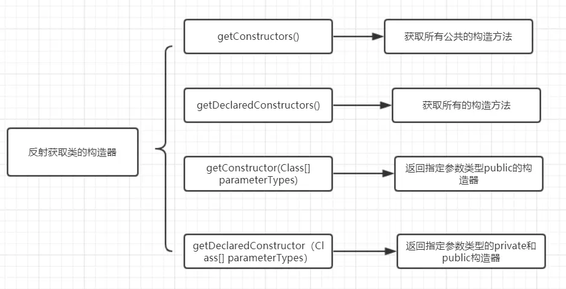
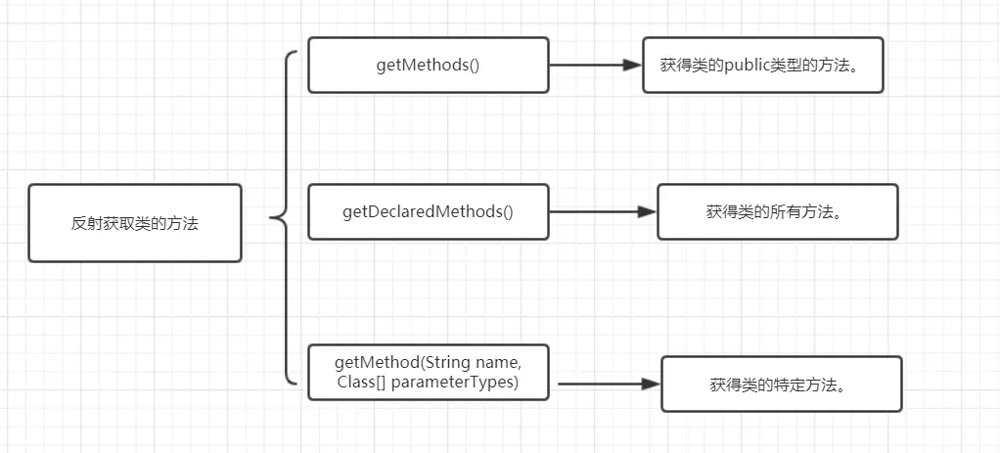
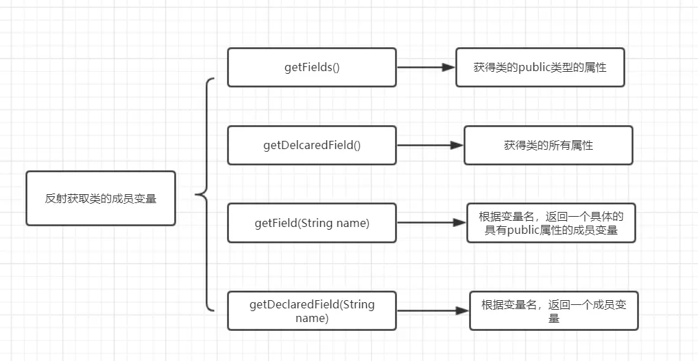
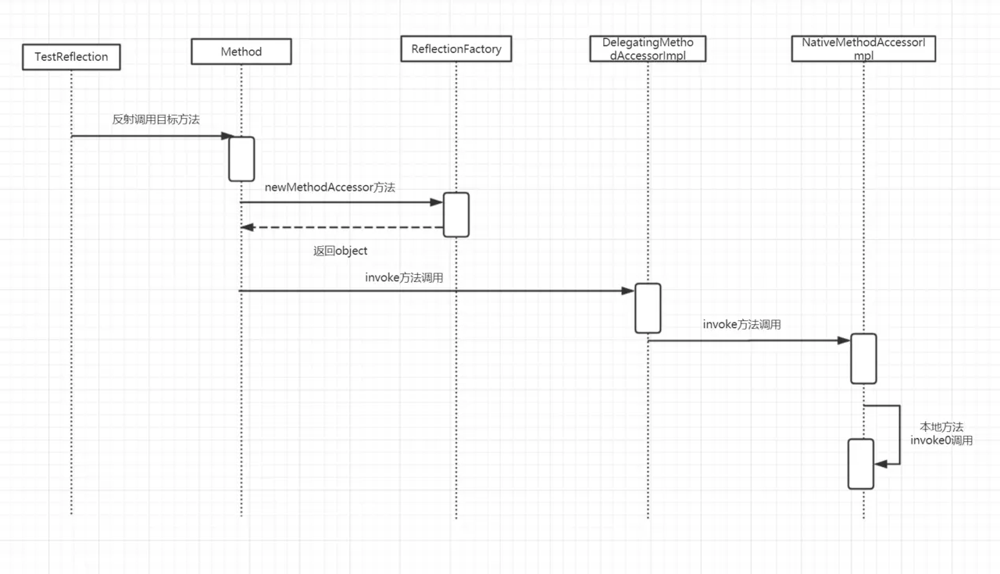

# Spring 

## 反射
Java 的反射机制是指在运行状态中，对于任意一个类都能够知道这个类所有的属性和方法； 并且对于任意一个对象，都能够调用它的任意一个方法；这种动态获取信息以及动态调用对象方法的功能成为Java语言的反射机制。
### Class对象
每个类都有一个Class对象，每当编译一个新类就产生一个Class对象。比如：创建一个`ReflectionDemo`类，JVM就会创建一个`ReflectionDemo`类对应的Class对象，该Class对象保存了`ReflectionDemo`类相关的类型信息。

Class类对象的作用是运行时提供或获取某个对象的类型信息。

#### RTTI与RRTI

Java是如何让我们在运行时识别对象和类的信息？

- RRTI：RRTI假定我们在编译器就知道所有的对象类型。
- RTTI，**Run-Time Type Identification**，在运行时识别一个对象的类型和类的信息。

### 反射的基本使用

#### 获取Class对象

##### Class.forName静态方法

```java
Class clz = Class.forName("base.reflection.ReflectionDemo");
```

##### 类的.class方法

```java
Class clz = ReflectionDemo.class;
```

##### 实例对象的 getClass() 方法

```java
ReflectionDemo demo = new ReflectionDemo();
Class clz = demo.getClass();
```

#### 反射获取类信息

##### 创造对象

1. 通过Class的`newInstance()`方法

```java
Class clz = Class.forName("base.reflection.ReflectionDemo");
ReflectionDemo demo = (ReflectionDemo) clz.newInstance();
```

2. 通过Constructor的`newInstance()`方法

```java
Class clz = Class.forName("base.reflection.ReflectionDemo");
Constructor constructor = clz.getConstructor();
ReflectionDemo demo1 = (ReflectionDemo) constructor.newInstance();
```

##### 获取构造函数



1. 获取所有public的构造方法： `getConstructors()`

```java
Class clz = Class.forName("base.reflection.ReflectionDemo");
Constructor[] constructors = clz.getConstructors();
```

2. 获取所有的构造方法：`getDeclaredConstructors()`

```java
// 所有 public + protect + private
Class clz = Class.forName("base.reflection.ReflectionDemo");
Constructor[] declaredConstructors = clz.getDeclaredConstructors();
```

3. 获取指定参数类型且是public的构造器：`getConstructor(Class<?>... parameterTypes)`

```java
Class clz = Class.forName("base.reflection.ReflectionDemo");
Constructor paramConstructor = clz.getConstructor(String.class);
```

4. 获取指定参数类型public或private的构造器：`getDeclaredConstructor(Class<?>... parameterTypes)`

```java
// public/private，protect不行
Class clz = Class.forName("base.reflection.ReflectionDemo");
Constructor declaredParamConstructor = clz.getDeclaredConstructor(Integer.class);
```

##### 获取方法



1. 获得类的public类型的方法：`getMethods()`， 包括继承自Object类的方法

   ```java
   Class clz = Class.forName("base.reflection.ReflectionDemo");
   Method[] pubMethods = clz.getMethods();
   System.out.println(pubMethods.length);
   ```

2. 获得本类的所有方法：`getDeclaredMethods()`， 不包括Object类的方法

   ```java
   Class clz = Class.forName("base.reflection.ReflectionDemo");
   Method[] clzMethods = clz.getDeclaredMethods();
   ```

3. 指定参数获取类的特定方法：`getDeclaredMethod(String name, Class<?>... parameterTypes)`

   ```java
   // private 不行
   Class clz = Class.forName("base.reflection.ReflectionDemo");
   Method declaredMethod = clz.getDeclaredMethod("print", int.class);
   declaredMethod.invoke(clz.newInstance(), 1);
   ```

##### 获取成员变量



1. 获得类的public属性：`getFields()`

   ```java
   Class clz = Class.forName("base.reflection.ReflectionDemo");
   Field[] pubFields = clz.getFields();
   ```

2. 获得类的所有属性：`getDeclaredFiled()`

   ```java
   Class clz = Class.forName("base.reflection.ReflectionDemo");
   Field[] fields = clz.getDeclaredFields();
   ```

3. 根据变量名获得一个public的属性：`getField(String name)`

   ```java
   Class clz = Class.forName("base.reflection.ReflectionDemo");
   Field pubField = clz.getField("num");
   ```

4. 根据变量名获得成员变量：`getDeclaredFiled(String name)`

   ```java
   // 不限制访问权限
   Class clz = Class.forName("base.reflection.ReflectionDemo");
   Field declaredField = clz.getDeclaredField("param");
   ```

### 反射原理



```java
	// 测试类的测试方法
    @Test
    public void test_reflection_print_invoke_method() throws ClassNotFoundException, NoSuchMethodException,
            InvocationTargetException, IllegalAccessException, InstantiationException {
        Class clz = Class.forName("base.reflection.ReflectionDemo");
        Method declaredMethod = clz.getDeclaredMethod("printNum", int.class);
        declaredMethod.invoke(clz.newInstance(), 111);
    }

	// ReflectionDemo类的printNum方法打印调用链
    protected void printNum(int num) {
        //打印堆栈信息
        new Exception("#" + num).printStackTrace();
        System.out.println("invoke target method");
    }
```

输出

```text
invoke target method
java.lang.Exception: #111
	at base.reflection.ReflectionDemo.printNum(ReflectionDemo.java:23)
	at sun.reflect.NativeMethodAccessorImpl.invoke0(Native Method)
	at sun.reflect.NativeMethodAccessorImpl.invoke(NativeMethodAccessorImpl.java:62)
	at sun.reflect.DelegatingMethodAccessorImpl.invoke(DelegatingMethodAccessorImpl.java:43)
	at java.lang.reflect.Method.invoke(Method.java:498)
	at base.reflection.ReflectionDemoTest.test_reflection_print_invoke_method(ReflectionDemoTest.java:114)
	····· 省略测试类调用链路
```

先来看`Method.invoke()`源码

```java
   	// Method.invoke
	@CallerSensitive
    public Object invoke(Object obj, Object... args)
        throws IllegalAccessException, IllegalArgumentException,
           InvocationTargetException
    {
        if (!override) {
            if (!Reflection.quickCheckMemberAccess(clazz, modifiers)) {
                Class<?> caller = Reflection.getCallerClass();
                checkAccess(caller, clazz, obj, modifiers);
            }
        }
        // MethodAccessor接口有三个实现类：DelegatingMethodAccessorImpl、MethodAccessorImpl、NativeMethodAccessorImpl
        MethodAccessor ma = methodAccessor;             // read volatile
        if (ma == null) {
            ma = acquireMethodAccessor();
        }
        return ma.invoke(obj, args);
    }
    
	// Method.invoke -> Method.aquireMethodAccessor
    private MethodAccessor acquireMethodAccessor() {
        // First check to see if one has been created yet, and take it
        // if so
        MethodAccessor tmp = null;
        if (root != null) tmp = root.getMethodAccessor();
        if (tmp != null) {
            methodAccessor = tmp;
        } else {
            // Otherwise fabricate one and propagate it up to the root
            tmp = reflectionFactory.newMethodAccessor(this);
            setMethodAccessor(tmp);
        }

        return tmp;
    }

	// Method.acquireMethodAccessor -> ReflectionFactory.newMethodAccessor
    public MethodAccessor newMethodAccessor(Method var1) {
        checkInitted();
        if (noInflation && !ReflectUtil.isVMAnonymousClass(var1.getDeclaringClass())) {
            return (new MethodAccessorGenerator()).generateMethod(var1.getDeclaringClass(), var1.getName(), var1.getParameterTypes(), var1.getReturnType(), var1.getExceptionTypes(), var1.getModifiers());
        } else {
            NativeMethodAccessorImpl var2 = new NativeMethodAccessorImpl(var1);
            // DelegatingMethodAccessorImpl extends MethodAccessorImpl
            DelegatingMethodAccessorImpl var3 = new DelegatingMethodAccessorImpl(var2);
            var2.setParent(var3);
            return var3;
        }
    }
	// ReflectionFactory.newMethodAccessor -> NativeMethodAccessorImpl构造方法
    NativeMethodAccessorImpl(Method var1) {
        this.method = var1;
    }
// ReflectionFactory.newMethodAccessor -> DelegatingMethodAccessorImpl构造方法
class DelegatingMethodAccessorImpl extends MethodAccessorImpl {
    private MethodAccessorImpl delegate;

    DelegatingMethodAccessorImpl(MethodAccessorImpl var1) {
        this.setDelegate(var1);
    }

    public Object invoke(Object var1, Object[] var2) throws IllegalArgumentException, InvocationTargetException {
        // this.delegate = NativeMethodAccessorImpl
        return this.delegate.invoke(var1, var2);
    }

    void setDelegate(MethodAccessorImpl var1) {
        this.delegate = var1;
    }
}
	// DelegatingMethodAccessorImpl -> NativeMethodAccessorImpl.invoke()
    public Object invoke(Object var1, Object[] var2) throws IllegalArgumentException, InvocationTargetException {
        if (++this.numInvocations > ReflectionFactory.inflationThreshold() && !ReflectUtil.isVMAnonymousClass(this.method.getDeclaringClass())) {
            MethodAccessorImpl var3 = (MethodAccessorImpl)(new MethodAccessorGenerator()).generateMethod(this.method.getDeclaringClass(), this.method.getName(), this.method.getParameterTypes(), this.method.getReturnType(), this.method.getExceptionTypes(), this.method.getModifiers());
            this.parent.setDelegate(var3);
        }
		// 就是它！Method的invoke方法，是由本地方法invoke0决定的
        return invoke0(this.method, var1, var2);
    }
```

### 反射应用

#### JDBC数据库连接

加载驱动，获得数据库连接

```java
Class.forName("com.mysql.jdbc.Driver");
Connection conn = DriverManager.getConnection("jdbc:mysql://localhost:3306/test", "root", "123456");
```

#### Spring框架

Spring 通过 XML 配置模式装载 Bean，也是反射的一个典型例子。

通过Spring框架使用Bean， 不用每次都去new实例了，并且可以修改配置文件，比较灵活。

**装载过程：**

- 将程序内XML 配置文件加载入内存中
- Java类解析xml里面的内容，得到相关字节码信息
- 使用反射机制，得到Class实例
- 动态配置实例的属性，使用

### 反射存在的问题

#### 安全问题

我们知道单例模式的设计过程中，会强调**将构造器设计为私有**，因为这样可以防止从外部构造对象。但是反射可以获取类中的域、方法、构造器，**修改访问权限**。所以这样并不一定是安全的。

```java
    // 测试类
	@Test
    public void test_reflection_modify_access_permission() throws ClassNotFoundException, NoSuchMethodException,
            IllegalAccessException, InvocationTargetException, InstantiationException {
        Class clz = Class.forName("base.reflection.ReflectionDemo");
        Constructor constructor = clz.getDeclaredConstructor(Integer.class);
        // 绕过Java语言访问检查
        constructor.setAccessible(true);
        // 打印 private constructor， num = 111
        constructor.newInstance(111);
    }
	// ReflectionDemo类私有构造方法
    private ReflectionDemo(Integer pram) {
        System.out.println("private constructor， num = " + num);
    }
```


#### 性能问题

反射的性能并不好，原因主要是编译器没法对反射相关的代码做优化。

## Spring IOC

## Spring AOP


## 参考

- [谈谈Java反射：从入门到实践，再到原理](https://juejin.im/post/5de3242e6fb9a071886675d7#heading-24)


