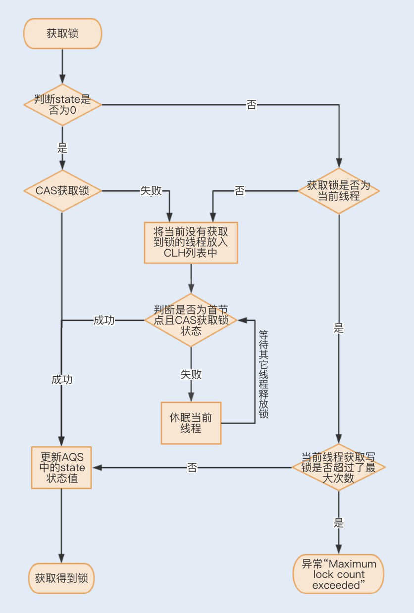

# AQS
`AbstractQueuedSynchronizer`抽象类，抽象队列同步器。

- 抽象：抽象类，提供方法及简单实现，具体实现由子类完成；

- 队列：利用了CLH变体的虚拟双向队列（FIFO）存储等待的线程；

  > CLH：Craig、Landin and Hagersten队列，是单向链表，AQS中的队列是CLH变体的虚拟双向队列（FIFO）。

- 同步器：AQS是一种提供了**原子式管理同步状态、阻塞和唤醒线程功能以及队列模型**的简单框架；

JUC中的大部分同步类都是基于AQS实现的，比如`Lock`、`ReentrantLock`、`Semaphore`、`CountDownLatch`等。

## AQS原理
### AQS获取锁流程

## 参考

- [AQS](http://concurrent.redspider.group/article/02/11.html)
- [从ReentrantLock的实现看AQS的原理及应用](https://tech.meituan.com/2019/12/05/aqs-theory-and-apply.html)