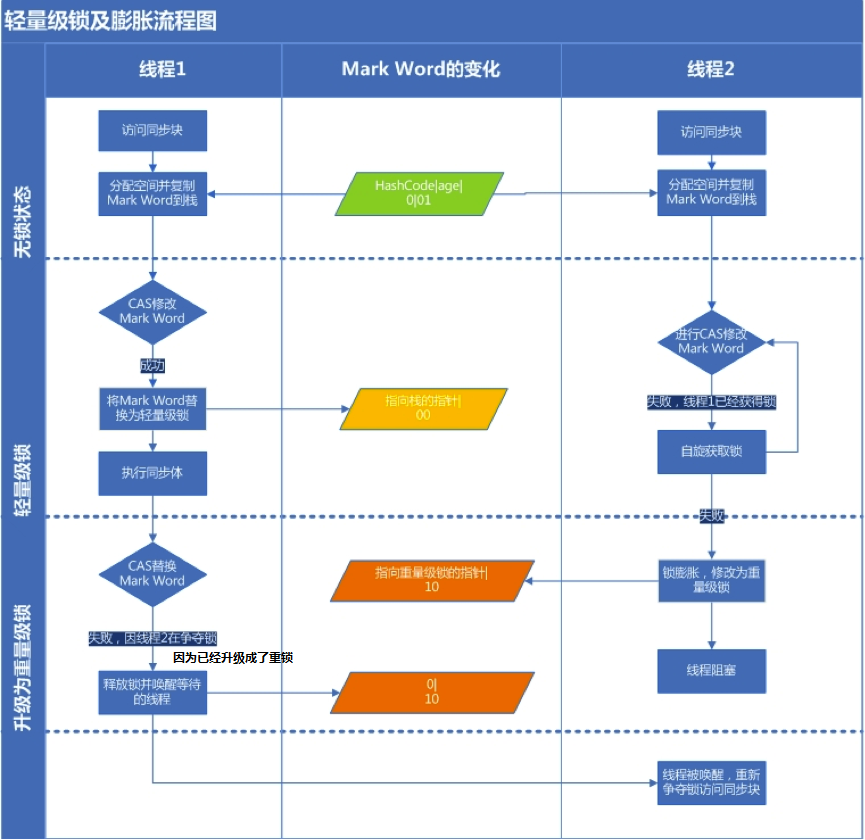

# 锁

## 同步

> 同步，指的是线程按一定顺序执行。

## 锁

> 锁，是一种线程同步机制。

按照是否含有某一特性来定义锁：


### 悲观锁和乐观锁	


#### 悲观锁

> 对于同一个数据的并发操作，悲观锁认为自己在使用数据的时候一定有别的线程来修改数据，所以在获取数据的时候会先加锁。Java中，**synchronized关键字**和**Lock的实现类**都是悲观锁。

悲观锁调用示例：

```java
// ------------------------- 悲观锁的调用方式 -------------------------
// synchronized
public synchronized void testMethod() {
    // 操作同步资源
}
// ReentrantLock
private ReentrantLock lock = new ReentrantLock(); // 需要保证多个线程使用的是同一个锁
public void modifyPublicResources() {
    lock.lock();
    // 操作同步资源
    lock.unlock();
}
```

可以看出悲观锁都是在显示的锁定（synchronized/lock()）之后再操作同步资源。

#### 乐观锁

> 与悲观锁相反，乐观锁认为自己在使用数据的时不会有别的线程来修改数据，所以获取数据的时候不会添加锁。但是，悲观锁会在更新数据的时候去判断之前有没有别的线程更新了这个数据。如果数据没有被更新过，当前线程会将自己修改的数据写入；如果数据被其他的线程更新，则会根据具体的实现方式进行不同的操作（例如报错）。

乐观锁调用示例：

```java
// ------------------------- 乐观锁的调用方式 -------------------------
private AtomicInteger atomicInteger = new AtomicInteger();  // 需要保证多个线程使用的是同一个AtomicInteger
atomicInteger.incrementAndGet(); //执行自增1
```

乐观锁通常都直接操作同步资源。

##### CAS

> **CAS（Compare And Swap：比较与交换）是乐观锁的主要实现方式**。

#### 应用场景

- 悲观锁适合写操作多的场景，先加锁可以保证写操作时数据正确。
- 悲观锁适合读操作多的场景，不加锁使得读操作的性能大幅提升。

### 自旋锁 和 适应性自旋锁

#### 自旋锁

> **阻塞或者唤醒一个Java线程需要操作系统切换CPU状态**，这种状态的切换需要耗费处理器时间。如果同步的内容过于简单，有可能出现状态转换消耗的时间有可能比同步代码执行得时间还长。  
>
> 在很多场景中，同步资源的锁定时间很短，为了这一段时间而切换线程，**线程的挂起和恢复花费的时间可能会很影响系统的性能**。如果**物理机器有多个处理器**，能让两个或两个以上线程**并行**执行，我们就可以让后面那个请求锁的线程不放弃CPU的执行时间，等待持有锁的那个线程释放锁。
>
> 为了让当前线程等待一下，我们需要让当前线程进行自旋，如果在自旋完成后，前面锁定同步资源的线程已经释放了锁，那么当前线程就可以不必进入阻塞而是直接获取同步资源，从而避免线程切换的开销。这种不放弃CPU执行时间，通过自旋不进入阻塞而是直接获取同步资源的锁，我们成为自旋锁。
>
> 自旋锁的实现原理同样为CAS。

> 
>
> 自旋锁的缺点
>
> - 不能代替阻塞。
> - 虽然避免了线程切换的开销，但它要占用处理器的时间（不放弃CPU的执行时间）。
> - 如果锁被占用的时间短，自旋等待就很适用。反之，如果锁被占用的时间长，自旋的线程只会拜拜浪费处理器资源。（所以，自旋等待的时间必须要有一定限度，不能无限自旋，如果超过了限定次数（默认10次）都还没有获得锁，就应该挂起线程）

#### 自适应自旋锁

> 自适应意味着自旋的时间（次数）不在固定，而是由前一次在同一个锁上的自旋时间及锁的拥有者的状态来决定。
>
> 如果在同一个锁对象上，自旋等待刚刚成功获得过锁，并且在持有锁的线程正在运行中，那么虚拟机就会认为这次自旋很有可能再次成功，那么它将允许自旋等待持续相对更长的时间。
>
> 如果对于某个锁，自旋很少成功获得过，那么在以后尝试获取这个锁时将很可能省略掉自旋过程，直接阻塞线程，避免浪费处理器资源。
>
> 自旋锁中，另有三重常见的锁形式：TicketLock、CLHlock和MCSlock。
>
> 锁不能降级只能升级，其中很大的一部分原因就是：避免无用的自旋。

### 无锁 偏向锁 轻量级锁 重量级锁

这四种锁指的是锁的状态，专门针对于synchronized。级别从低到高依次是：无锁->偏向锁->轻量级锁->重量级锁。**锁的状态只能升级不能降级**。

> synchronized在操作同步资源前需要给同步资源加锁，这把锁就是存在在**Java对象头**里。
>
> Java对象头：
>
> 我们以Hotspot虚拟机为例，Hotspot的对象头主要包括两部分数据：Mark Word（标记字段）、Klass Pointer（类型指针）。
>
> **Mark Word**：默认存储对象的HashCode，分代年龄和锁标志位信息。这些信息都是与对象自身定义无关的数据，所以Mark Word被设计成一个非固定的数据结构以便在极小的空间内存存储尽量多的数据。它会根据对象的状态复用自己的存储空间，也就是说在运行期间Mark Word里存储的数据会随着锁标志位的变化而变化。
>
> > Mark Word 格式：
> >
> > | 锁状态   | 29 bit 或 61 bit                          | 1 bit 是否是偏向锁？       | 2 bit 锁标志位 |
> > | -------- | ----------------------------------------- | -------------------------- | -------------- |
> > | 无锁     |                                           | 0                          | 01             |
> > | 偏向锁   | 线程ID                                    | 1                          | 01             |
> > | 轻量级锁 | 指向栈中锁记录的指针                      | 此时这一位不用于标识偏向锁 | 00             |
> > | 重量级锁 | 指向互斥量（重量级锁，Monitor对象）的指针 | 此时这一位不用于标识偏向锁 | 10             |
> > | GC标记   |                                           | 此时这一位不用于标识偏向锁 | 11             |
>
> **Klass Point**：对象指向它的类元数据的指针，虚拟机通过这个指针来确定这个对象是哪个类的实例。
>
> Monitor：
>
> > Monitor可以理解为一个同步工具或一种同步机制，通常被描述为一个对象。每个Java对象就有一把看不见的锁，我们通常称为内部锁或者Monitor锁。
> >
> > Monitor是线程私有的数据结构，每一个线程都有一个可用monitor record列表，同时还有一个全局的可用列表。每一个被锁住的对象都会和一个monitor关联，同时monitor中有一个Owner字段存放拥有该锁的线程的唯一标识，表示该锁被这个线程占用。
>
> synchronized通过Monitor来实现线程同步，Monitor是依赖于底层的操作系统的Mutex Lock（互斥锁）来实现的线程同步。

#### 无锁

> 无锁没有对资源进行锁定，所有的线程都能访问并修改同一个资源，但同时只有一个线程能修改成功。
>
> 无锁的特点就是修改操作在循环内进行，线程会不断的尝试修改共享资源。如果没有冲突就修改成功并退出，否则就会继续循环尝试。如果有多个线程修改同一个值，必定会有一个线程能修改成功，而其他线程修改失败但会不断重试直到修改成功。
>
> CAS的原理及应用就是无锁的实现。
>
> 无锁无法全面替代有锁，但无锁在某些场合（比如读操作多的场景）下性能很高。

#### 偏向锁

> 偏向锁，是指一段同步代码一直被一个线程锁访问，那么该线程就会自动获取锁，以降低获取锁的代价。
>
> 在大多数情况下，锁总是由同一个线程多次获得，偏向锁就是针对这种情况出现的。偏向锁的目标就是在只有一个线程执行同步代码块时能够提高性能。
>
> 当一个线程获取锁并访问同步代码块时，会在Java对象头的Mark Word里存储偏向的线程id。在线程进入和退出同步代码块时不再通过CAS操作来加锁和解锁，而是检测Mark Word里是否存储着指向当前线程的偏向锁。
>
> 偏向锁只有在遇到其他线程尝试竞争偏向锁时，原来持有偏向锁的线程才会释放锁，线程不会主动释放偏差锁。
>
> 引入偏向锁时为了在无多线程竞争的情况下尽量减少不必要的轻量级锁执行路径。轻量级锁的获取及释放依赖多次CAS原子指令，而偏向锁只需要在置换ThreadID的时候依赖依次原子指令即可。

偏向锁自JDK6后默认启用，可以通过JVM配置参数`-XX:-UseBiasedLocking=false`关闭。

偏向锁的获得及撤销流程：


#### 轻量级锁

> 指处于偏向锁时，被另外的线程所访问，偏向锁此时就会升级为轻量级锁，其他线程就会通过自旋的形式尝试获取锁，不会阻塞，从而提高性能。

轻量级锁膨胀流程图：



#### 重量级锁

> 在处于轻量级锁时，若当前只有一个等待线程，则该线程通过自旋进行等待。但是当自旋超过一定的次数，或者一个线程在持有锁，一个在自旋，又有第三个线程来访问，此时轻量级锁就会升级为重量级锁。

### 公平锁 非公平锁

#### 公平锁

> 公平锁是指多个线程**严格按照申请锁的顺序**来获取锁。线程直接进入队列中排队，队列中的第一个线程才能获得锁。
>
> 公平锁的优点是等待锁的线程不会被“饿死”。
>
> 公平锁的缺点是整体吞吐率相对比非公平锁要低，等待队列中除第一个线程以外的所有线程都会被阻塞， CPU唤醒阻塞线程的开销相对较大。

#### 非公平锁

> 非公平锁是多个线程加锁时先直接尝试获取锁，获取不到才到等待队列的队尾等候。
>
> 如果线程在直接获取锁时刚好锁可用，那么这个线程就可以不经过阻塞直接获取到锁，所以非公平锁有可能出现后申请锁但先获取锁的场景。
>
> 非公平锁的优点是可以减小唤起线程所需的开销，整体吞吐率较高。此外，线程还有几率不阻塞直接获取到锁，CPU不必唤醒所有线程。
>
> 缺点就是处于等待队列中的线程可能会被“饿死”，或者等待很久才能获取到锁。

公平锁就是通过同步队列来实现多个线程按照申请锁的顺序来获取锁。而非公平锁加锁时不考虑排队等待的问题，直接尝试获取锁，所以存在后申请却先获得锁的情况。

### 可重入锁 非可重入锁

#### 可重入锁

> 可重入锁又名递归锁，是指同一个线程在外层方法获取锁的时候，在进入该线程的内层方法时会自动获取锁（前提是锁对象是同一个对象或者类），不会因为之前已经获取过还美释放而阻塞。
>
> Java中ReentrantLock和synchronized都是可重入锁。
>
> 可重入锁的一个优点是可以一定程度避免死锁。

#### 非可重入锁

> 非可重入锁在调用内层方法之前需要将执行外层方法时获取的当前锁对象释放掉，而实际上该对象锁已被当前线程所持有且无法释放，所以此时会出现死锁。

### 独享锁 共享锁

#### 独享锁

> 独享锁也叫做**排它锁**，指的是该锁一次只能被一个线程所持有。如果一个线程对某个数据加上排它锁之后，其他线程就不能再对这个数据加任何类型的锁了。
>
> 获得排它锁的线程既能读数据又能修改数据。
>
> JDK中的`synchronized`、JUC中的Lock实现类以及`ReentrantLock`里的公平锁和非公平锁都是独享锁。
>

#### 共享锁

> 共享锁是指该锁可被多个线程持有。
>
> 如果一个线程对某个数据加上共享锁后，其他线程只能对这个数据加共享锁，不能加排他锁。
>
> 获得共享锁的线程只能读数据，不能修改数据。
>
> JUC中的`Semaphore`、`CountDownLatch`就是共享锁。

### 死锁

死锁是指两个及以上的线程在执行过程中，由于竞争资源或彼此通信问题造成的一种阻塞现象，若无外力作用，它们都将无法推进下去。此时称系统处于死锁状态或系统产生了死锁，这些永远在互相等待的进程称为死锁进程。

#### 代码示例

```java
public class DeadLock {

    public static void main(String[] args) {
        // 局部变量，方法调用后被加载在虚拟机栈
        final Object lock1 = new Object();
        final Object lock2 = new Object();
        
        Thread thread1 = new Thread(() -> {
           // sychronized特性，互斥锁（排它锁，独享锁，与之对应的是共享锁）：该锁一次只能被一个线程所持有
           synchronized (lock1) {
               System.out.println("thread1 lock1");
               try {
                   // 此处用sleep方法是为了增大出现死锁几率，不用也行，多试几次
                   // sleep方法不会释放锁
                   Thread.sleep(1000L);
               } catch (InterruptedException e) {
                   e.printStackTrace();
               }
               // synchronized特性之，可重入锁：同一个线程在外层方法获取锁的时候，再进入该线程的内层方法会自动获取锁（前提锁对象得是同一个对象或者class），不会因为之前已经获取过还没释放而阻塞
               // 如果sychronized不是可重入锁，那么光是调用`thread1.start()`执行到这里就会阻塞，此时lock1没释放
               synchronized (lock2) {
                   System.out.println("thread1 lock2");
               }
           }
        });

        Thread thread2 = new Thread(() -> {
           synchronized (lock2) {
               System.out.println("thread2 lock2");
               try {
                   Thread.sleep(1000L);
               } catch (InterruptedException e) {
                   e.printStackTrace();
               }
               synchronized (lock1) {
                   System.out.println("thread2 lock1");
               }
           }
        });

        thread1.start();
        thread2.start();
    }

}
```

输出

```java
// 1，2的顺序不固定，看线程心情（加锁快慢）
thread1 lock1
thread2 lock2
```

#### 死锁检测

- `jps`获取进程号， `jstack`查看当前进程的堆栈信息（`jstack -h`获取使用帮助）
- `jconsole`调用系统自带工具（windows）

#### 如何预防死锁

1. 以确定的顺序获得锁

比如上面代码示例中，都以lock1-> lock2的顺序获取锁，就不会出现相互等待其他线程释放锁的情况。

多线程，银行家算法。 // todo

2. 超时放弃获得锁

在使用`sychronized`提供的内置锁时，线程获取不到锁会一直等待。

但在`Lock`接口中，提供了`boolean tryLock(long time, TimeUnit unit) throws InterruptedException;`，该方法可以让线程按照固定时长等待锁，该方法在指定时间内获取到锁返回`true`。

## CAS

Compare And Swap，比较和交换。

CAS需要有3个操作数：主内存中的变量V，旧的预期值E，即将要更新的目标值N。具体交换过程如下：

> 当CAS指令执行时，判断V是否等于E，如果等于，将V的值设置为N；如果不等，说明已经有其它线程更新了V，则当前线程放弃更新，什么都不做。

**整个CAS的比较和替换操作是一个原子操作**。

#### CAS的问题

##### ABA

ABA问题是值一个值经过多次更新又变成了原来的值，而使用CAS时感知不到这个已经发生的变化。

常见的ABA问题解决思路是在变量前加**版本号或时间戳**。此时类似ABA的就会变成1A2B3A。

JDK1.5起JDK的atomic包里提供了一个类`AtomicStampedReference`来解决ABA问题。

##### 循环时间长开销大

CAS通常与自旋结合。如果自旋CAS长时间不成功，会占用大量的CPU资源。

解决思路是让JVM支持处理器提供的**pause指令**。

> pause指令能让自旋失败时cpu睡眠一小段时间再继续自旋，从而使得读操作的频率低很多，为解决内存顺序冲突而导致的CPU流水线重排的代价也会小很多。

##### 只能保证一个共享变量的原子操作

解决方案

- JDK1.5起JDK的atomic包里提供的`AtomicReference`类能保证对象之间的原子性，把多个变量放到一个对象里进行CAS操作
- 锁，在锁对应的临界区内的代码可以保证只有一个线程执行

# 参考

- [不可不说的Java“锁”事](https://tech.meituan.com/Java_Lock.html)
- [Java CAS 原理剖析](https://juejin.im/post/5a73cbbff265da4e807783f5)