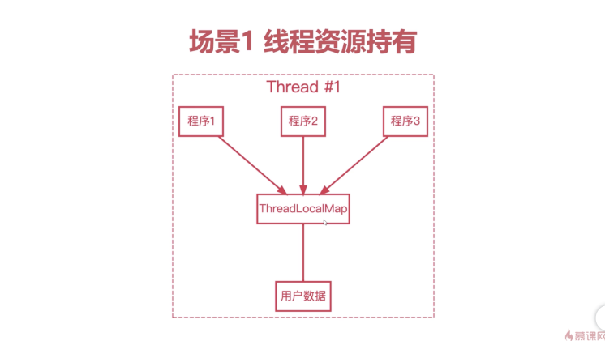
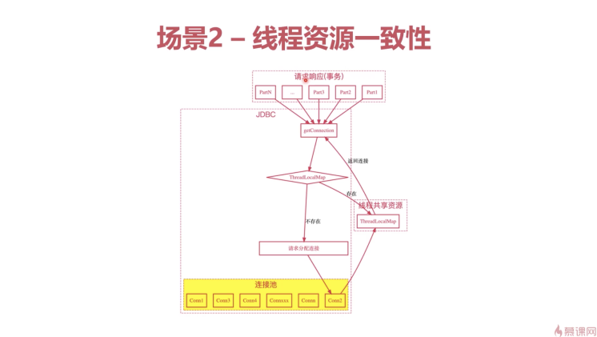
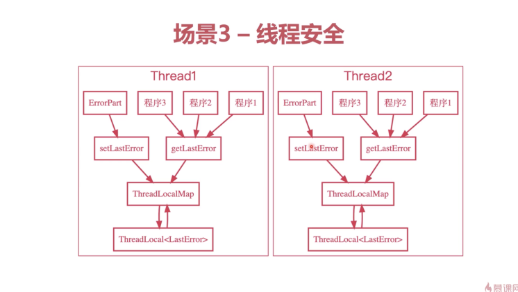
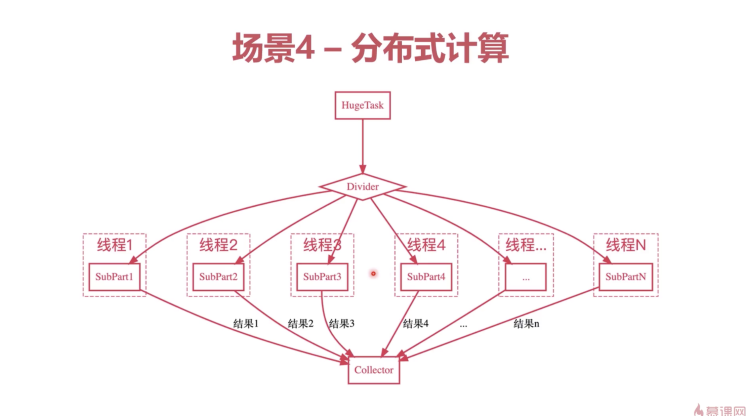
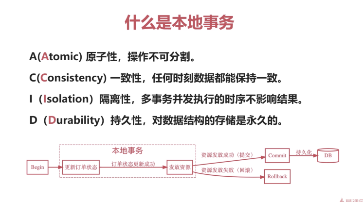
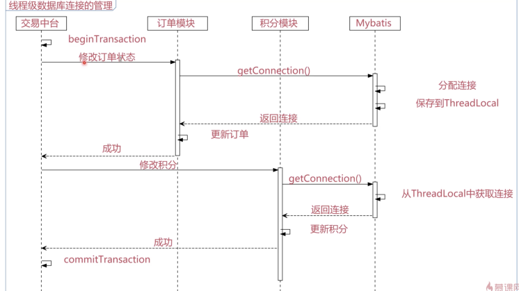
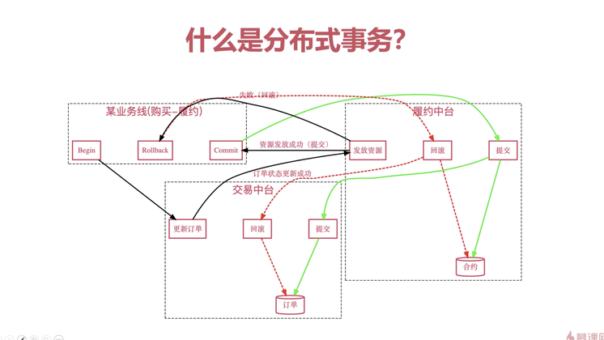

# ThreadLocal

## 介绍

### ThreadLocal是什么

定义： **提供线程局部变量**。一个线程局部变量在多个线程中，分别有独立的值（副本）。

特点：简单（开箱即用），快速（无额外开销），**线程安全**。

场景：常见的多线程场景。比如资源持有，线程一致性，并发计算，线程安全等。

### ThreadLocal API

- 构造函数 `ThreadLocal<T>()`
- 初始化函数 `initialValue()`
- 访问器 `get/set()`
- 回收 `remove()`

### 并发概念

- 并发： 多个程序同时执行
- 竞争条件：**多个线程同时访问同一个内存资源**，最终的执行结果依赖于多个线程执行的**精准时序**
- 临界区：访问共享内存的程序片段

## 场景分析

### 线程资源持有

持有线程资源供线程的各个部分使用，全局获取，减少**编程难度**。

### 线程资源一致性

帮助需要保持线程一致的资源（如数据库事务）维护一致性，降低**编程难度**。

### 线程安全

帮助只考虑了单线程的程序库，无缝向多线程场景迁移。

### 分布式计算

帮助分布式计算场景的各个线程累计局部计算结果。

## 源码解读

### Quarz-SimpleSemaphore

`Quarz`的`SimpleSemaphore`提供资源隔离。

`SimpleSemaphore`中的`lockOwners(ThreadLocal)`为重度锁操作， 前置过滤

### Mybatis框架保持连接池线程一致

#### 本地事务

#### 线程级数据库连接的管理

### Spring框架对分布式事务的支持

