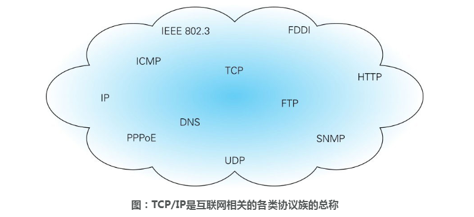
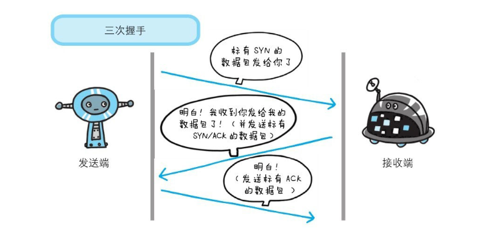
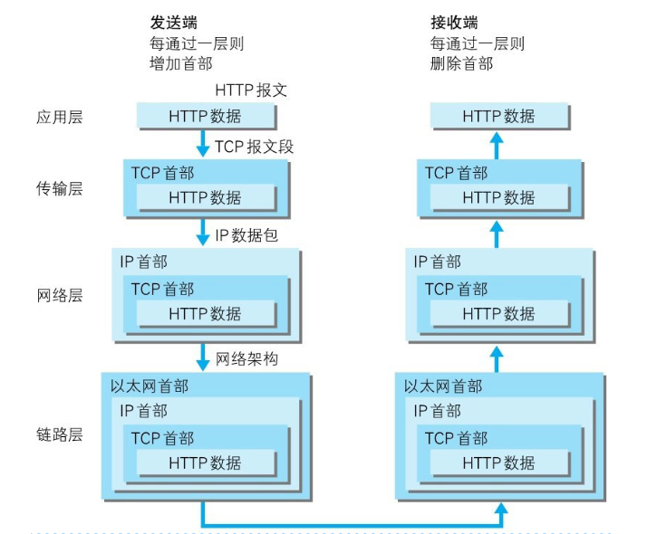
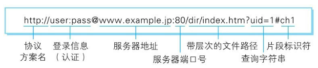
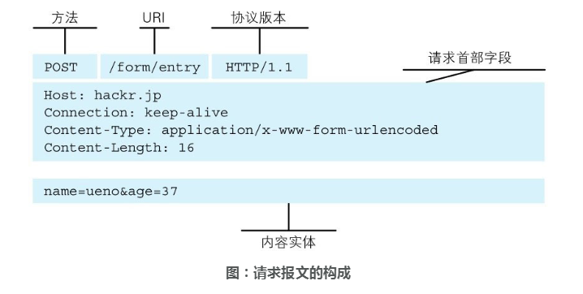
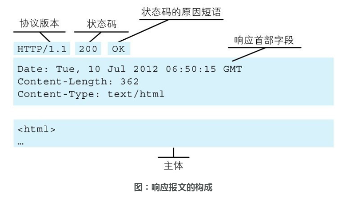

# 网络协议

## web及网络基础

### TCP/IP

把互联网相关联的协议集合起来总称为**TCP/IP**，我们通常使用的网络都是在**TCP/IP协议族**的基础上运作的。



#### TCP/IP的分层

TCP/IP协议族按层次分为以下4层：应用层、传输层、网络层、数据链路层。

> 也有7层分层的说法：应用层、表示层、会话层、传输层、网络层、数据链路层、物理层。
>
> 7层中的应用层、表示层、会话层对应4层中的应用层，数据链路层和物理层就对应4层中的数据链路层。

分层的目的是明确职责，也便于维护。

##### 应用层

决定向用户提供应用服务时通信的活动。

TCP/IP协议族内预存了各类通用的应用服务。如HTTP、DNS、FTP等。

###### HTTP协议

HTTP协议的职责：生成针对目标服务器的HTTP请求报文。

###### DNS服务

DNS（Domain Name System）是位于应用层的服务，主要**提供域名到IP地址之间的解析服务**。

域名符合人的记忆习惯，而计算机更擅长处理IP地址的处理。DNS就为了解决这类问题：**DNS协议提供通过域名查找IP地址，或者通过IP地址反查域名的服务。**

##### 传输层

传输层是应用层的下层，主要提供**处于网络连接中**的两台计算机之间的数据传输。

传输层的两个协议：TCP（Transmission Control Protocol，传输控制协议）和UDP（User Data Protocol，用户数据报协议）。

###### TCP协议及三次握手

TCP协议位于传输层，负责保证可靠性，**TCP协议提供了可靠的字节流传输服务**（分段发送+收取重组）。

字节流服务（Byte Stream Service）是指，为了方便传输，将大块数据分割成以报文段（segment）为单位的数据包进行管理。

三次握手：

为了准确无误地将数据**送达**目标，TCP协议采用了三次握手策略（three-way handshaking）。

发送端首先发送一个带SYN标志的数据包给对方。接收端收到后，回传一个带有SYN/ACK标志的数据包以示传达确认信息。最后，发送端再回传一个带ACK标志的数据包，代表“握手”结束。

若在握手过程中某个阶段莫名中断，TCP协议会再次以相同的顺序发送相同的数据包。



##### 网络层（网络互连层）

网络层主要处理网络上流动的数据包。在与对方计算机之间通过多台计算机或网络设备进行传输时，网络层所起的作用就是在众多的选项内选择一条传输路线。

数据包是网络传输的最小数据单位。

###### IP协议

IP协议和IP地址是两个不同的概念。

IP协议位于网络层，负责传输，作用是将各种数据包传输给对方。

IP地址指明了节点被分配的地址，MAC地址是指网卡所属的固定地址。

##### 数据链路层（网络接口层、链路层）

用来处理连接网络的硬件部分。包括控制操作系统、硬件的设备驱动、NIC（NetworkInterface Card，网络适配器，即网卡），及光纤等物理可见部分（还包括连接器等一切传输媒介）。硬件上的范畴均在链路层的作用范围之内。

常说的物理层指的是网络路线，在4层分层里网络路线属于数据链路层。

数据链路层属于4层分层的最下层。

#### TCP/IP的通信传输流

发送端在层与层之间传输数据时，每经过一层时必定会被打上一个该层所属的首部信息。反之，接收端在层与层传输数据时，每经过一层时会把对应的首部消去。这种把数据信息包装起来的做法称为**封装**（encapsulate）。



HTTP协议通信过程（DNS -> HTTP->TCP -> IP -> TCP->HTTP）：


### URI和URL

#### URI

URI是统一资源标识符（Uniform Resource Identifier）的缩写。URI是某个协议方案表示的资源的定位标识符。

- Uniform：规定**统一**的格式以处理多种不同类型的资源（而不用上下文环境来识别指定的访问方式），如http:或ftp:。
- Resource：**资源**的定义是可标识的任何东西。包括但不限于文档文件、图片或其他服务，只要区别与其他类型的全都可以作为资源。资源可以是单一的，也可以是集合体。
- Identifier：表示可以**标识**的对象，也称为标识符。

比如，采用HTTP方案时，协议就是http，此外还有ftp，mailto，telnet，file等30余种。

几种URI示例：

```text
ftp://192.168.4.xxx/pub/mongodb.txt
http://192.168.4.18/pub/mongodb.txt
mailto://test@163.com
news://www.news.com
telnet://192.168.4.18:8080/
```

##### URI格式

绝对URI格式如下：



- 协议方案名：使用http：或https：等协议方案名获取访问资源时要指定协议类型。
- 登录信息：可选项，指定用户名和密码作为从服务器获取资源的登录信息。
- 服务器地址：必填项，可以是DNS可以解析的域名，可以是IPv4地址名，也可以是IPv6地址名。
- 服务器端口号：可选项，没有则使用默认端口号。
- 带层次的文件路径：必填项，指定服务器上的文件路径还定位特指的资源。
- 查询字符串：可选项，针对指定文件路径内的资源，可使用查询字符串传入任意参数。
- 片段标识符：可选项，使用片段标识符通常可标记出已获取资源中的子资源（文档内的某个位置）。

##### 指定请求URI

- URI为完整的请求URI

  > GET http://www.baidu.com/index.html HTTP/1.1

- 在首部字段Host中写明域名或IP地址

  > GET /index/html HTTP/1.1
  >
  > Host: baidu.com

#### URL

URI用字符串标识某一互联网资源，而URL表示资源的地点（在互联网所处的位置）。

URL是URI的子集。

## HTTP协议

HTTP协议位于应用层，用于客户端与服务器之间的通信。

HTTP协议从客户端开始通信，服务器端在没有收到请求之前不会发送响应。

### 简单的HTTP协议

#### 请求报文与响应报文

-  请求报文的构成



- 响应报文的构成



#### 无状态的协议

HTTP是一种无状态协议（stateless），HTTP自身不对请求和响应之间的通信状态进行保存。

HTTP协议不保存之前一切的请求或响应报文的信息，是**为了更快地处理大量事务，确保协议的可伸缩性**。

#### 请求方法

##### GET

获取资源。

GET方法用来请求访问已被URI识别的资源。指定的资源经服务器解析后返回响应内容。如果请求资源是文本，返回文本内容；如果是通用网关接口（CGI，Common Gateway Interface），返回执行后的输出结果。

##### POST

传输实体主题。

GET方法也可以传输实体主体，但一般不用
GET方法传输。通常使用POST传输的主要目的不是获取响应的主体内容。

##### PUT

传输文件。

PUT方法就像FTP的文件上传协议一样，**要求在请求报文的主体中包含文件内容**，然后保存到URI指定的位置。

鉴于HTTP/1.1的PUT方法自身不带验证机制，任何人都可以上传文件，存在安全性问题，因此一般的Web网站不使用该方法。若配合Web应用程序的验证机制，或架构设计采用**REST（Representational State Transfer，表征状态转移）**标准的同类Web网站，就可能会开放使用PUT方法。

##### HEAD

获得报文首部。

HEAD和GET一样都是获取资源，不过HEAD不获取报文主体，只获取报文首部。一般用于确认URI的有效性及资源更新日期等。

##### DELETE

删除文件。

与PUT方法相反，DELETE是按请求URI删除指定位置的资源。

DELETE和PUT方法一样也不带验证机制，同样也常在遵循REST标准是开放使用。

##### OPTIONS

询问支持的方法。

OPTIONS用来查询**针对请求URI指定的资源**所支持的方法。也就是询问请求支持哪些方法，在跨域请求时常用OPTIONS方法确认请求所支持的方法。

##### TRACE

追踪路径。

TRACE方法是让Web服务器将之前的通信请求回环给客户端。

TRACE请求容易引起跨站追踪（XST，Cross-Site Tracing）攻击，不常用到。

##### CONNECT

要求用隧道协议连接代理。

CONNECT方法要求在与代理服务器通信时建立隧道，实现用隧道协议进行TCP通信。主要使用SSL（Secure Sockets Layer，安全套接层）和TLS（Transport Layer Security，传输层安全）协议把通信内容加密后经网络隧道传输。

HTTP支持的请求方法如下：


#### 持久化连接

##### 持久连接

HTTP协议的初始版本中，每一次HTTP通信就会断开一次TCP连接。

单个连接如下：


为了**避免在同一个网页中请求多个资源时造成的通信量开销（反复连接和断开）**类似问题，部分HTTP1.0和HTTP1.1提供了持久连接（HTTP Persistent Connections，也称为HTTP keep-alive或HTTP connection reuse）的方法。

持久化连接：


持久连接的特点是只要任意一端没有提出断开连接的请求，则一直保持TCP连接状态。

持久连接的好处在于减少了TCP连接的重复建立和断开所造成的额外开销，减轻了服务器端的负载。

**HTTP1.1中，所有的连接默认都是持久连接。**

##### 管线化

从前发送请求后需等待并收到响应，才能发送下一个请求。管线化技术（piplining）出现后，不用等待响应亦可直接发送下一个请求。

管线化:


管线化是在持久化的基础上的升级。比如请求一个包含10张图片的Web页面，请求时长管线化大于持久化大于挨个连接。

#### 使用Cookie进行状态管理

HTTP协议是无状态的协议，而Cookie的出现是为了解决在无状态协议的基础上保留请求状态的问题。Cookie技术通过在请求和响应报文中写入Cookie信息来控制客户端的状态。

Cookie会根据从服务器端发送的响应报文内的一个叫做Set-Cookie的首部字段信息，通知客户端保存Cookie。当下次客户端再往该服务器发送请求时，客户端会自动在请求报文中加入Cookie值后发送出去。

Cookie信息交换路径：

> 请求报文(无Cookie信息)->响应报文(服务端生成Cookie信息并返回)->二次请求(自动发送保存的Cookie信息)

### HTTP报文

### HTTP状态码

### HTTP首部

### Web服务器

## HTTPS

## 参考

- 《图解HTTP》
- [趣谈网络协议](https://time.geekbang.org/column/intro/85)