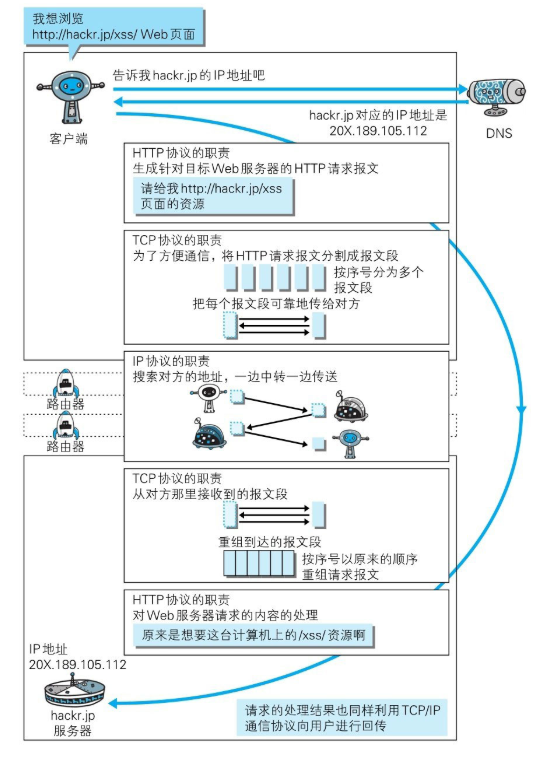

# 网络协议

## web及网络基础

### TCP/IP

把互联网相关联的协议集合起来总称为**TCP/IP**，我们通常使用的网络都是在**TCP/IP协议族**的基础上运作的。

#### TCP/IP的分层

TCP/IP协议族按层次分为以下4层：应用层、传输层、网络层、数据链路层。

也有说法物理层为数据链路后的第五层。

分层的目的是明确职责，也便于维护。

##### 应用层

决定向用户提供应用服务时通信的活动。

TCP/IP协议族内预存了各类通用的应用服务。如HTTP、DNS、FTP等。

###### HTTP协议

HTTP协议的职责：生成针对目标服务器的HTTP请求报文。

###### DNS服务

DNS（Domain Name System）是位于应用层的服务，主要**提供域名到IP地址之间的解析服务**。

域名符合人的记忆习惯，而计算机更擅长处理IP地址的处理。DNS就为了解决这类问题：**DNS协议提供通过域名查找IP地址，或者通过IP地址反查域名的服务。**

##### 传输层

传输层是应用层的下层，主要提供**处于网络连接中**的两台计算机之间的数据传输。

传输层的两个协议：TCP（Transmission Control Protocol，传输控制协议）和UDP（User Data Protocol，用户数据报协议）。

###### TCP协议及三次握手

TCP协议位于传输层，负责保证可靠性，**TCP协议提供了可靠的字节流传输服务**（分段发送+收取重组）。

字节流服务（Byte Stream Service）是指，为了方便传输，将大块数据分割成以报文段（segment）为单位的数据包进行管理。

三次握手：

为了准确无误地将数据**送达**目标，TCP协议采用了三次握手策略（three-way handshaking）。

发送端首先发送一个带SYN标志的数据包给对方。接收端收到后，回传一个带有SYN/ACK标志的数据包以示传达确认信息。最后，发送端再回传一个带ACK标志的数据包，代表“握手”结束。

若在握手过程中某个阶段莫名中断，TCP协议会再次以相同的顺序发送相同的数据包。

##### 网络层（网络互连层）

网络层主要处理网络上流动的数据包。在与对方计算机之间通过多台计算机或网络设备进行传输时，网络层所起的作用就是在众多的选项内选择一条传输路线。

数据包是网络传输的最小数据单位。

###### IP协议

IP协议和IP地址是两个不同的概念。

IP协议位于网络层，负责传输，作用是将各种数据包传输给对方。

IP地址指明了节点被分配的地址，MAC地址是指网卡所属的固定地址。

##### 数据链路层（网络接口层、链路层）

用来处理连接网络的硬件部分。包括控制操作系统、硬件的设备驱动、NIC（NetworkInterface Card，网络适配器，即网卡），及光纤等物理可见部分（还包括连接器等一切传输媒介）。硬件上的范畴均在链路层的作用范围之内。

常说的物理层指的是网络路线，在4层分层里网络路线属于数据链路层。

数据链路层属于4层分层的最下层。

#### TCP/IP的通信传输流

发送端在层与层之间传输数据时，每经过一层时必定会被打上一个该层所属的首部信息。反之，接收端在层与层传输数据时，每经过一层时会把对应的首部消去。这种把数据信息包装起来的做法称为**封装**（encapsulate）。

HTTP协议通信过程（DNS -> HTTP->TCP -> IP -> TCP->HTTP）：

### URI和URL

## 参考

- 《图解HTTP》
- [趣谈网络协议](https://time.geekbang.org/column/intro/85)